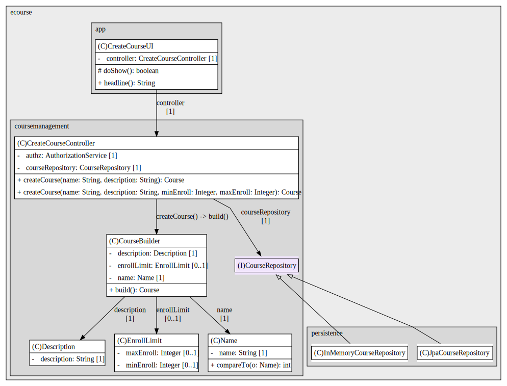

# US 1002 - Create Courses

As Manager, I want to create courses.

## 1. Context

The goal of this US is to generate a Course and store it within the database.

## 2. Requirements

* FRC01 - Create Course Different editions of a course are to be considered different courses (e.g., Intro-Math-Sem01,
  Intro-Math Sem02).
* FRC01 - Only managers are able to execute this functionality.
* Automatically generated identifier
* Unique Name
* Description has characters limit, defined in configuration file
* Optionally, has enrollment limits
* Created in "close" state

## 3. Analysis

...

## 4. Design

### 4.1. Realization

*Sequence Diagram*

### 4.2. Class Diagram

*Class Diagram*

*Course Class Diagram*

### 4.3. Applied Patterns

* Builder
* DDD

### 4.4. Tests

**Test 1-2:** *Verifies that it is not possible to create an instance of the EnrollmentLimits with null values*

    @Test(expected = IllegalArgumentException.class)
    public void ensureEnrollmentLimitsMinimumNonNegative() {
        EnrollLimit enrollLimit = new EnrollLimit(-1, 1);
    }

    @Test(expected = IllegalArgumentException.class)
    public void ensureEnrollmentLimitsMaximumNonNegative() {
        EnrollLimit enrollLimit = new EnrollLimit(1, -1);
    }

**Test 3:** *Verifies that it is not possible to create an instance of the EnrollmentLimits with maximum lower than minimum*

    @Test(expected = IllegalArgumentException.class)
    public void ensureEnrollmentLimitsMaximumHigherThanMinimum() {
        EnrollLimit enrollLimit = new EnrollLimit(11, 10);
    }

**Test 3:** *Verifies that it is not possible to create an instance of the Description that excesses character limit defined in config file*

    @Test(expected = IllegalArgumentException.class)
    public void ensureDescriptionLimit() {
        Description description = new Description("a".repeat(Math.max(0, LIMIT + 1)));
    }

**Test 4:** *Verifies that it is not possible to create an instance of the Description null or empty*

    @Test(expected = IllegalArgumentException.class)
    public void ensureDescriptionNotNullOrEmpty() {
        Description description1 = new Description("");
        Description description2 = new Description(null);
    }

**Test 5:** *Verifies that it is not possible to create an instance of the Name null or empty*

    @Test(expected = IllegalArgumentException.class)
    public void ensureNameNotNullOrEmpty() {
        Name name1 = new Name("");
        Name name2 = new Name(null);
    }

**Test 6:** *Verifies that 2 different courses with the same attributes are the same*

    @Test
    public void ensureCourseSameEqualAttributes() throws Exception {
        Course course1 = new CourseBuilder().withName("Java-1").withDescription("Java intro 22").withEnrollLimit(80, 120).build();
        Course course2 = new CourseBuilder().withName("Java-1").withDescription("Java intro 22").withEnrollLimit(80, 120).build();
        assertTrue(course1.sameAs(course2));
    }

**Test 7:** *Verifies that 2 different courses with a different Name are not equal*

    @Test
    public void ensureCourseNotSameDifferentName() throws Exception {
        Course course1 = new CourseBuilder().withName("Java-2").withDescription("Java intro 22").withEnrollLimit(80, 120).build();
        Course course2 = new CourseBuilder().withName("Java-1").withDescription("Java intro 22").withEnrollLimit(80, 120).build();
        assertFalse(course1.sameAs(course2));
    }

**Test 7:** *Verifies that 2 different courses with a different Description are not equal*

    @Test
    public void ensureCourseNotSameDifferentDescription() throws Exception {
        Course course1 = new CourseBuilder().withName("Java-1").withDescription("Java intro 22").build();
        Course course2 = new CourseBuilder().withName("Java-1").withDescription("Java intro 23").build();
        assertFalse(course1.sameAs(course2));
    }

**Test 7:** *Verifies that 2 different courses with a different EnrollLimits are not equal*

    @Test
    public void ensureCourseNotSameDifferentLimits() throws Exception {
        Course course1 = new CourseBuilder().withName("Java-1").withDescription("Java intro 22").withEnrollLimit(80, 120).build();
        Course course2 = new CourseBuilder().withName("Java-1").withDescription("Java intro 22").withEnrollLimit(80, 140).build();
        assertFalse(course1.sameAs(course2));
    }

## 5. Implementation

Course: *attribute and constructor*

    @Entity
    public class Course implements AggregateRoot<Name> {

        /**
         * ORM primary key. Autogenerated value
         */
        @Id
        @GeneratedValue(strategy = GenerationType.AUTO)
        private Long courseId;
    
        /**
         * Business ID
         */
        @Embedded
        private Name name;
    
        @Embedded
        private Description description;
    
        @Embedded
        private EnrollLimit enrollLimit;
    
        @Enumerated(EnumType.STRING)
        private State state;
    
        protected Course() {
            //ORM only
        }
    
        /**
         * Constructor
         *
         * @param name        Mandatory, Unique
         * @param description Mandatory
         * @param enrollLimit Optional
         */
        public Course(Name name, Description description, EnrollLimit enrollLimit) {
            Preconditions.noneNull(name, description);
            setName(name);
            setDescription(description);
            setEnrollLimit(enrollLimit);
            this.state = State.CLOSED;
        }
    }

**Controller:** *create course*

    public Course createCourse(String name, String description) {
        return createCourse(name, description, null, null);
    }

    public Course createCourse(String name, String description, Integer minEnroll, Integer maxEnroll) {
        authz.ensureAuthenticatedUserHasAnyOf(BaseRoles.POWER_USER, BaseRoles.ADMIN);

        final CourseBuilder courseBuilder = new CourseBuilder();
        courseBuilder.withName(name).withDescription(description);
        if (minEnroll != null && maxEnroll != null) {
            courseBuilder.withEnrollLimit(minEnroll, maxEnroll);
        }
        Course course = courseBuilder.build();
        return this.courseRepository.save(course);
    }

**Name** *constructor and setter*

    /**
     * Constructor
     *
     * @param name
     */
    public Name(String name) {
        setName(name);
    }

    /**
     * Validates if name is not null or empty, then sets name
     */
    private void setName(String name) {
        if (StringPredicates.isNullOrEmpty(name)) {
            throw new IllegalArgumentException("Name cannot be null or empty");
        }
        this.name = name;
    }

**Description:** *constructor and setter*

    /**
     * Constructor
     *
     * @param description
     */
    public Description(String description) {
        setDescription(description);
    }

    /**
     * Validates if description doesnt excess value defined in config file, then sets description
     */
    private void setDescription(String description) {
        if (StringPredicates.isNullOrEmpty(description)) {
            throw new IllegalArgumentException("Description cannot be null or empty");
        }
        if (description.length() > Application.settings().getCourseDescriptionCharacterLimit())
            throw new IllegalArgumentException("Description excess character limit");
        this.description = description;
    }

**EnrollLimit** *contructor and setter*

    /**
     * Constructor
     *
     * @param minEnroll Mandatory (0, INTEGER.MAX)
     * @param maxEnroll Mandatory (0, INTEGER.MAX)
     */
    public EnrollLimit(Integer minEnroll, Integer maxEnroll) {
        setEnrollLimit(minEnroll, maxEnroll);
    }

    /**
     * Validates if values are not negative nor maximum value smaller than minimum, then sets values
     */
    private void setEnrollLimit(Integer minEnroll, Integer maxEnroll) {
        setMinEnroll(minEnroll);
        setMaxEnroll(maxEnroll);
    }

    public void setMinEnroll(Integer minEnroll) {
        Preconditions.nonNegative(minEnroll, "Minimum enrollment cannot be negative");
        if (minEnroll > maxEnroll) {
            throw new IllegalArgumentException("Maximum limit must be higher than minimum");
        }
        this.minEnroll = minEnroll;
    }

    public void setMaxEnroll(Integer maxEnroll) {
        Preconditions.nonNegative(maxEnroll, "Maximum enrollment cannot be negative");
        if (minEnroll > maxEnroll) {
            throw new IllegalArgumentException("Maximum limit must be higher than minimum");
        }
        this.maxEnroll = maxEnroll;
    }

**CourseRepository Interface** *extends domain repository from eapli.framework*

    public interface CourseRepository extends DomainRepository<Name, Course> {
    }

**JpaCourseRepository** *extends JpaAutoTxRepository and implements CourseRepository. Saves Course to database*

    public class JpaCourseRepository extends JpaAutoTxRepository<Course, Long, Name> implements CourseRepository {
    
        public JpaCourseRepository(final TransactionalContext autoTx) {
            super(autoTx, "courseId");
        }
    
        public JpaCourseRepository(final String puname) {
            super(puname, Application.settings().getExtendedPersistenceProperties(), "courseId");
        }
    } 

## 6. Integration/Demonstration

## 7. Observations

No observations