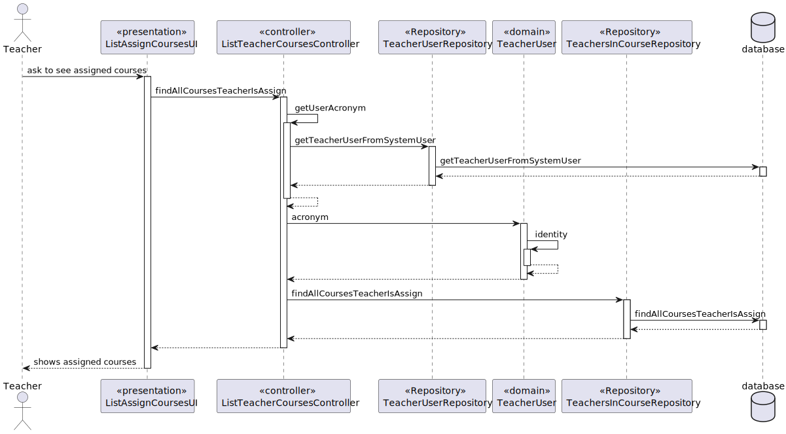
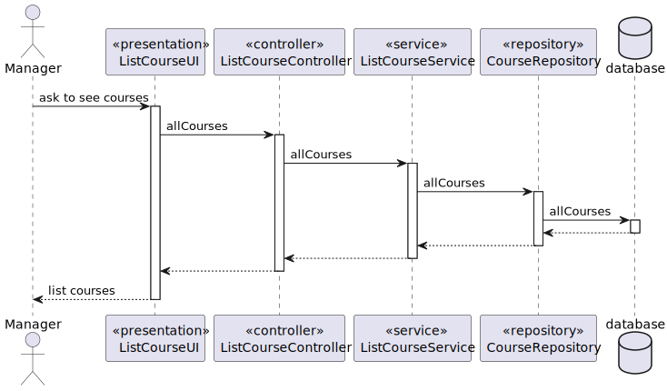
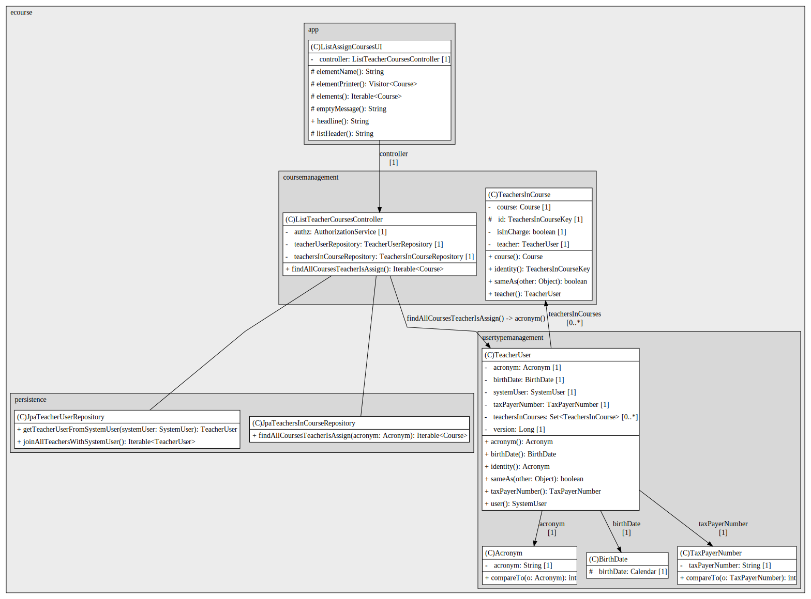
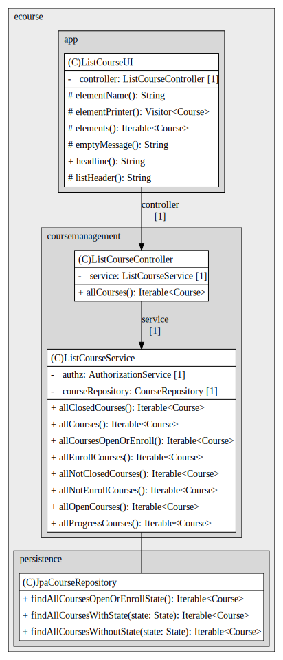
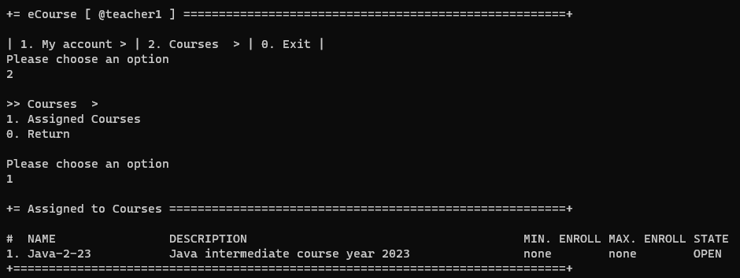
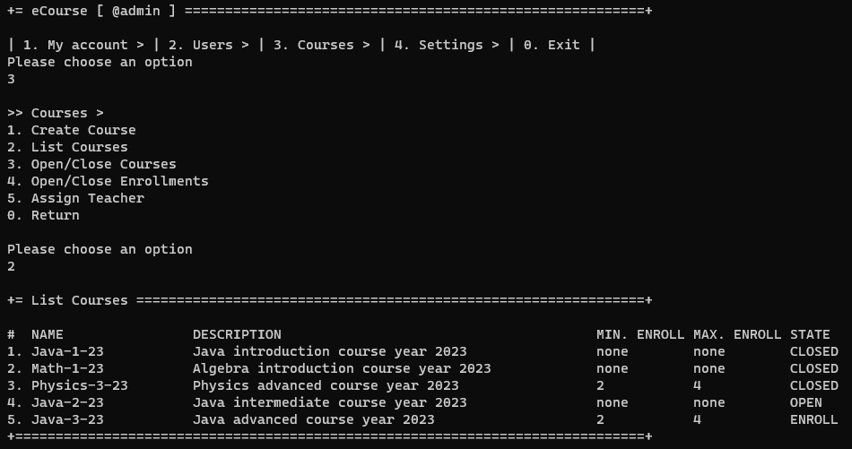

# US 1006 - List all the courses that are available to user

*As User, I want to list all the courses that are available to me*

## 1. Context

*The US is to list courses for each user role, with different courses accessible based on the user role.*

## 2. Requirements

* FRC05 - List Courses All users are able to execute this functionality
* Students have access to both the courses available for enrollment within the state 
and the courses in which they are currently enrolled
* Teachers have access to the courses they are assigned to teach
* Manager as access to all courses

## 3. Analysis

...

## 4. Design

*In this sections, the team should present the solution design that was adopted to solve the requirement. This should
include, at least, a diagram of the realization of the functionality (e.g., sequence diagram), a class diagram (
presenting the classes that support the functionality), the identification and rational behind the applied design
patterns and the specification of the main tests used to validade the functionality.*

### 4.1. Realization

*Sequence diagram teacher*

*Sequence diagram manager*
### 4.2. Class Diagram

*Class diagram teacher*

*Class diagram manager*

### 4.3. Applied Patterns

### 4.4. Tests

...

## 5. Implementation

*List courses service*

    /**
    * Application service to avoid code duplication. Lists all courses or in a state
      */
      @ApplicationService
      public class ListCourseService {
    
          private final AuthorizationService authz = AuthzRegistry.authorizationService();
          private final CourseRepository courseRepository = PersistenceContext.repositories().courses();
        
          public Iterable<Course> allClosedCourses() {
          authz.ensureAuthenticatedUserHasAnyOf(BaseRoles.ADMIN, BaseRoles.POWER_USER);
          return courseRepository.findAllCoursesWithState(State.CLOSED);
          }
        
          public Iterable<Course> allNotClosedCourses() {
          authz.ensureAuthenticatedUserHasAnyOf(BaseRoles.ADMIN, BaseRoles.POWER_USER, BaseRoles.TEACHER);
          return courseRepository.findAllCoursesWithoutState(State.CLOSED);
          }
        
          public Iterable<Course> allOpenCourses() {
          authz.ensureAuthenticatedUserHasAnyOf(BaseRoles.ADMIN, BaseRoles.POWER_USER, BaseRoles.TEACHER);
          return courseRepository.findAllCoursesWithState(State.OPEN);
          }
        
          public Iterable<Course> allEnrollCourses() {
          authz.ensureAuthenticatedUserHasAnyOf(BaseRoles.ADMIN, BaseRoles.POWER_USER, BaseRoles.STUDENT);
          return courseRepository.findAllCoursesWithState(State.ENROLL);
          }
        
          public Iterable<Course> allNotEnrollCourses() {
          authz.ensureAuthenticatedUserHasAnyOf(BaseRoles.ADMIN, BaseRoles.POWER_USER);
          return courseRepository.findAllCoursesWithoutState(State.ENROLL);
          }
        
          public Iterable<Course> allProgressCourses() {
          authz.ensureAuthenticatedUserHasAnyOf(BaseRoles.ADMIN, BaseRoles.POWER_USER);
          return courseRepository.findAllCoursesWithState(State.PROGRESS);
          }
        
          public Iterable<Course> allCoursesOpenOrEnroll() {
          authz.ensureAuthenticatedUserHasAnyOf(BaseRoles.ADMIN, BaseRoles.POWER_USER);
          return courseRepository.findAllCoursesOpenOrEnrollState();
          }
        
          public Iterable<Course> allCourses() {
          authz.ensureAuthenticatedUserHasAnyOf(BaseRoles.ADMIN, BaseRoles.POWER_USER);
          return courseRepository.findAll();
          }
      }

*Jpa query for courses assigned to a teacher*

    @Override
    public Iterable<Course> findAllCoursesTeacherIsAssign(Acronym acronym) {
        String jpql = "SELECT c FROM Course c " +
                "JOIN TeachersInCourse tic ON c.courseId = tic.course.id " +
                "WHERE tic.teacher.id = :teacherId";

        TypedQuery<Course> query = entityManager().createQuery(jpql, Course.class);
        query.setParameter("teacherId", acronym);

        return query.getResultList();
    }

## 6. Integration/Demonstration

*Teacher assigned courses*

*Manager courses*

## 7. Observations

The student listing feature was not implemented in this sprint due to the absence of student enrollment implementation. 
Once student enrollment is completed, the US will be reopened and this feature will be added.