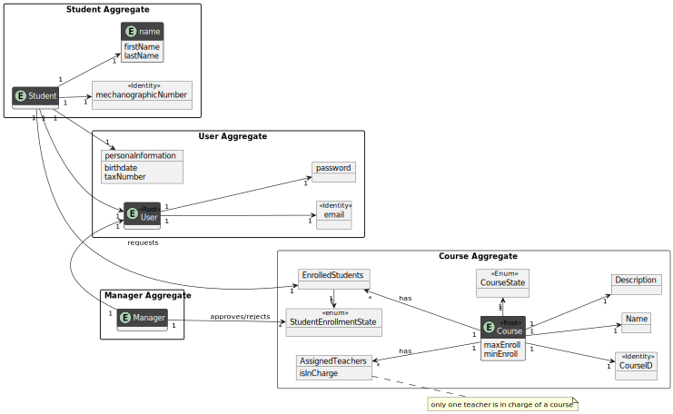
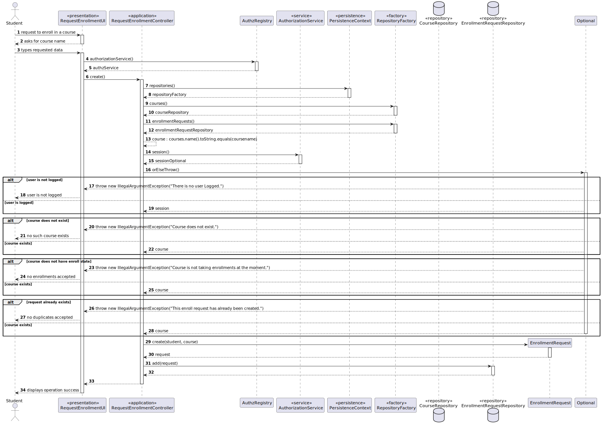
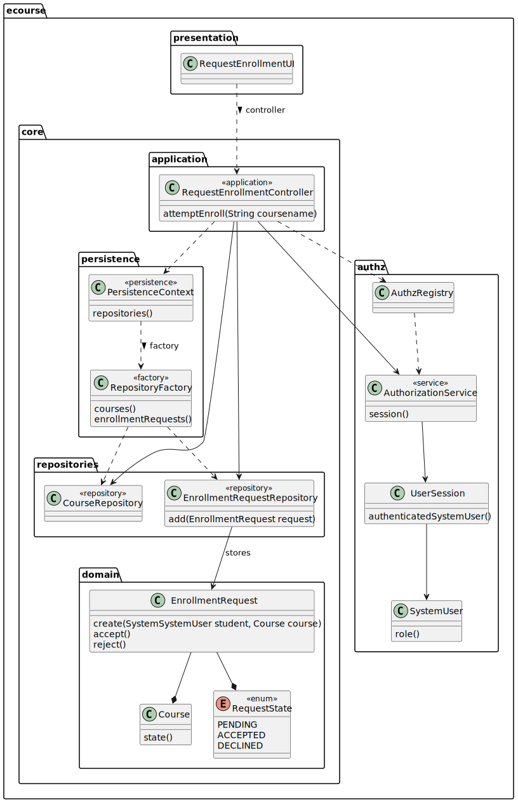
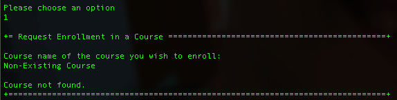
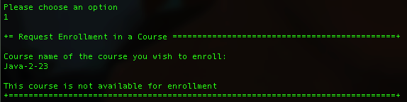
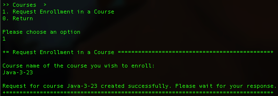

# US 1008 - Request Enrollment in a Course

*As Student, I want to request my enrollment in a course*

## 1. Context

*In order for a student to be enrolled into a course, he must first make a request and then be accepted by the manager.*

## 2. Requirements

The input to recognize the course that the student is trying to enroll in is the course name.
The restrictions for enrolling in a course are:
- I'm not already enrolled in this course.
- The course isn't full.
- The course is opened and with enroll state.
- I haven't sent a request for this course yet.

The dependencies of this user story are:

**US1002:** As Manager I want to create courses, since courses are needed to enroll students.

**US1004:** As Manager, I want to open and close enrollements in courses, since it's needed to let the students enroll.

## 3. Analysis



## 4. Design

### 4.1. Realization



### 4.2. Class Diagram



### 4.3. Applied Patterns

### 4.4. Tests

**Test 1:** *Verifies that all the State classes are well created.*

```
@Test
    public void returnsRequestStateString() {
        assertEquals("PENDING", RequestState.PENDING.name());
        assertEquals("ACCEPTED", RequestState.ACCEPTED.name());
        assertEquals("REJECTED", RequestState.REJECTED.name());
    }
````

**Test 2 and 3:** *Verifies that when creating a request it is being validated and created.*

```
@Test
    public void enrollmentRequestCreateWithClosedCourse() {
        RequestEnrollmentController controller = new RequestEnrollmentController();
        EnrollmentRequest test = controller.attemptEnroll("Java-2-23");
        assertEquals("\"This course is not available for enrollment\"", test.toString());
    }
    
    @Test
    public void enrollmentRequestCreatedWithValidCours(){
        RequestEnrollmentController controller = new RequestEnrollmentController();
        EnrollmentRequest test = controller.attemptEnroll("Java-3-23");
        assertEquals("Request for course Java-3-23 created successfully. Please wait for your response.", test.toString());
    }
````

## 5. Implementation

### 5.1. RequestEnrollmentUI

```java
public class RequestEnrollmentUI extends AbstractUI {
    private final RequestEnrollmentController ctrl =
            new RequestEnrollmentController();
    @Override
    protected boolean doShow() {
        try {
            String coursename = Console.readLine("Course name of the course you wish to enroll: ");
            System.out.println();

            ctrl.attemptEnroll(coursename);

            System.out.println("Request for course " +coursename+ " created successfully. Please wait for your response.");
        } catch (IllegalArgumentException iae){
            System.out.println(iae.getMessage());
        }
        return true;
    }

    @Override
    public String headline() {
        return "Request Enrollment in a Course";
    }
}

```

### 5.2. RequestEnrollmentController

```java
@UseCaseController
public class RequestEnrollmentController {
    private final AuthorizationService authz = AuthzRegistry.authorizationService();
    public EnrollmentRequest attemptEnroll(final String courseCodeString) {
        CourseRepository courseRepository = PersistenceContext.repositories().courses();
        Iterable<Course> courses = courseRepository.findAllCoursesOpenOrEnrollState();

        Course foundCourse = null;
        for (Course course : courses) {
            if (course.name().toString().equals(courseCodeString)) {
                foundCourse = course;
                break;
            }
        }

        if (foundCourse == null) {
            throw new IllegalArgumentException("Course not found.");
        }

        authz.ensureAuthenticatedUserHasAnyOf(BaseRoles.STUDENT);

        return EnrollmentRequest.create(
                authz.session().orElseThrow(
                        () -> new IllegalArgumentException("There is no user logged in.")
                ).authenticatedUser(),
                foundCourse
        );
    }

}
```

### 5.3. EnrollmentRequest

```java
public class EnrollmentRequest implements AggregateRoot<Long> {

    @Id
    @GeneratedValue(strategy = GenerationType.IDENTITY)
    private Long id;
    private SystemUser student;
    private Course course;
    private LocalDate DateOfRequest;
    private LocalDate ReplyDate; // só criada depois de aceitar ou rejeitar o request
    @Enumerated(EnumType.STRING)
    private RequestState state;
    protected EnrollmentRequest() {
    }
    private EnrollmentRequest(final SystemUser student, final Course course) {
        this.student = student;
        this.course = course;
        this.DateOfRequest = LocalDate.now();
        this.state = RequestState.PENDING;
        this.ReplyDate = null;
    }
    public static EnrollmentRequest create(final SystemUser student, final Course course) {
        Preconditions.noneNull(student, course);
        Preconditions.ensure(course.state().equals(State.ENROLL), "This course is not available for enrollment");
        /*
        Preconditions.ensure(
                course.hasStudent(student),
                "This student is already enrolled in this course"
        );
        Preconditions.ensure(
                course.limitOfStudents() == course.students().size(),
                "This course is already full"
        );
        */

        return new EnrollmentRequest(student, course);
    }

    @Override
    public boolean equals(final Object o) {
        if (this == o) {
            return true;
        }
        if (o == null || getClass() != o.getClass()) {
            return false;
        }

        EnrollmentRequest that = (EnrollmentRequest) o;

        if (!Objects.equals(student, that.student)) {
            return false;
        }
        return Objects.equals(course, that.course);
    }

    @Override
    public boolean sameAs(final Object other) {
        EnrollmentRequest that = (EnrollmentRequest) other;

        if (!Objects.equals(student, that.student)) {
            return false;
        }
        return Objects.equals(course, that.course);
    }

    public void accept() {
        Preconditions.ensure(!this.state.equals(RequestState.ACCEPTED), "This request has already been accepted.");
        this.state = RequestState.ACCEPTED;
        this.ReplyDate = LocalDate.now();
        // this.course.addStudent(this.student);
    }

    public void reject() {
        Preconditions.ensure(!this.state.equals(RequestState.REJECTED), "This request has already been rejected.");
        this.state = RequestState.REJECTED;
        this.ReplyDate = LocalDate.now();
    }
    @Override
    public Long identity() {
        return id;
    }
    public SystemUser student() {
        return student;
    }

    public Course course() {
        return course;
    }

    @Override
    public String toString() {
        return "Request " + this.id + "\n"
                + "Student: " + this.student.email() + "\n"
                + "Course: " + this.course.courseId() + "\n";
    }
    @Override
    public int hashCode() {
        final int hashConstant = 31;
        int result = student.hashCode();
        result = hashConstant * result + course.hashCode();
        return result;
    }

    public RequestState getState() {
        return state;
    }
}
```

### 5.4 RequestState
```java
package eapli.ecourse.enrollmentmanagement.domain;

public enum RequestState {
    /**
     * Pending request state.
     */
    PENDING,
    /**
     * Accepted request state.
     */
    ACCEPTED,
    /**
     * Rejected request state.
     */
    REJECTED;

    /**
     * The Value.
     */
    private String value;

    RequestState() {
        this.value = this.name();
    }

    /**
     * Value string.
     *
     * @return the string
     */
    String value() {
        return this.value;
    }
}


```


## 6. Integration/Demonstration

### 6.1 Non-Existing Course


### 6.2 Course not available for enrollment


### 6.3 Successful Request
