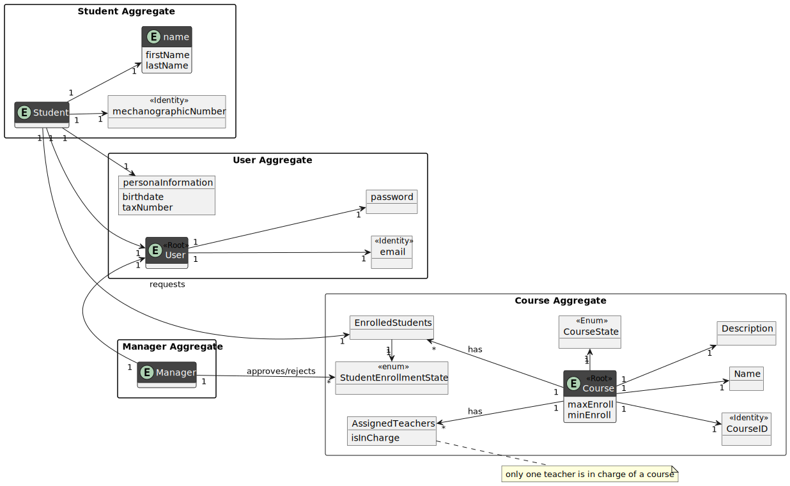
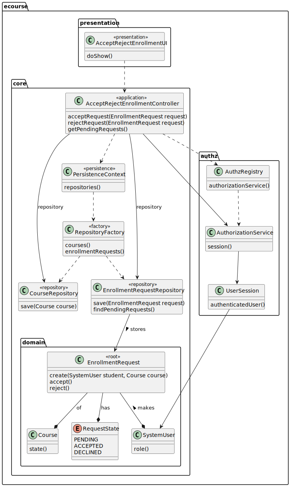
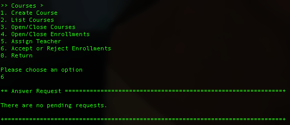
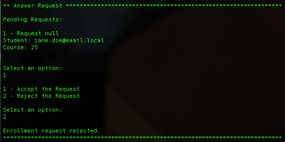

# US 1009 - To Approve/Reject an Enrollment Request

## 1. Context

*As Manager, I want to approve or reject students applications to courses.*

## 2. Requirements

The dependencies of this user story are:

**US1008:** As Student, I want to request my enrollment in a course, since a pending request is needed to be accepted or
rejected by the manager.

## 3. Analysis



## 4. Design

*In this sections, the team should present the solution design that was adopted to solve the requirement. This should
include, at least, a diagram of the realization of the functionality (e.g., sequence diagram), a class diagram (
presenting the classes that support the functionality), the identification and rational behind the applied design
patterns and the specification of the main tests used to validade the functionality.*

### 4.1. Realization


### 4.2. Class Diagram



### 4.3. Applied Patterns

### 4.4. Tests

**Test 1:** *Verifies that it is not possible to create an instance of the Example class with null values.*

```
@Test
    public void returnsRequestStateString() {
        assertEquals("PENDING", RequestState.PENDING.name());
        assertEquals("ACCEPTED", RequestState.ACCEPTED.name());
        assertEquals("REJECTED", RequestState.REJECTED.name());
    }
````

**Test 2:** *Verifies that a request can be accepted and its state is changed.*
```
@Test
    public void acceptRequest() {
        CourseRepository courseRepository = PersistenceContext.repositories().courses();
        Iterable<Course> courses = courseRepository.findAllCoursesOpenOrEnrollState();

        Course foundCourse = null;
        for (Course course : courses) {
            if (course.name().toString().equals("Java-3-23")) {
                foundCourse = course;
                break;
            }
        }
        System.out.println(foundCourse.name().toString());
        EnrollmentRequest test = EnrollmentRequest.create(AuthzRegistry.authorizationService().session().get().authenticatedUser(), foundCourse);
        test.accept();
        assertEquals("ACCEPTED", test.getState().name());
    }
````

**Test 3:** *Verifies that a request can be rejected and its state is changed.*

````
@Test
public void rejectRequest() {
CourseRepository courseRepository = PersistenceContext.repositories().courses();
Iterable<Course> courses = courseRepository.findAllCoursesOpenOrEnrollState();

        Course foundCourse = null;
        for (Course course : courses) {
            if (course.name().toString().equals("Java-3-23")) {
                foundCourse = course;
                break;
            }
        }
        System.out.println(foundCourse.name().toString());
        EnrollmentRequest test = EnrollmentRequest.create(AuthzRegistry.authorizationService().session().get().authenticatedUser(), foundCourse);
        test.accept();
        assertEquals("ACCEPTED", test.getState().name());
    }
````
## 5. Implementation

### 5.1. AcceptRejectEnrollmentUI

```
java
public class AcceptRejectEnrollmentUI extends AbstractUI {
    private final AcceptRejectEnrollmentController ctrl = new AcceptRejectEnrollmentController(PersistenceContext.repositories().courses());
    @Override
    protected boolean doShow() {

        try{
            List<EnrollmentRequest> pendingRequests = this.ctrl.getPendingRequests();
            EnrollmentRequest selected = selectRequest(pendingRequests, "Pending Requests:\n");
            boolean accept = asnwer();

            if(accept) {
                this.ctrl.accept(selected);
                System.out.println("Enrollment request accepted.");
            } else {
                this.ctrl.reject(selected);
                System.out.println("Enrollment request rejected.");
            }

        } catch (IllegalArgumentException iae){
            System.out.println(iae.getMessage());

            return false;
        }

        return true;
    }
    @Override
    public String headline() {
        return "Answer Request";
    }
    public EnrollmentRequest selectRequest(List<EnrollmentRequest> requests, String message){
        int i = 0;
        
        if (requests.isEmpty()) {
            throw new IllegalArgumentException("There are no pending requests.\n");
        }
        System.out.println(message);

        for(EnrollmentRequest request : requests){
            System.out.println(i+1 + " - " + request.toString()+"\n");
            i++;
        }

        int option;
        try{
            option = Integer.parseInt(Console.readLine("Select an option: "));
            System.out.println();
        }catch(NumberFormatException nfe){
            throw new IllegalArgumentException("Invalid option, try again.");
        }


        Preconditions.ensure(option > 0 && option <= requests.size(), "Invalid option, try again.");

        return requests.get(option-1);
    }
    public boolean asnwer(){
        System.out.println("1 - Accept the Request");
        System.out.println("2 - Reject the Request");
        int option = Integer.parseInt(Console.readLine("\nSelect an option: "));
        System.out.println();

        Preconditions.ensure(option == 1 || option == 2, "Invalid option, try again.");

        return option == 1;
    }
}


```

### 5.2. AcceptRejectEnrollmentController

```java
public class AcceptRejectEnrollmentController {
    private final CourseRepository coursesRepository;
    private final EnrollmentRequestRepository enrollmentRequestRepository;
    public AcceptRejectEnrollmentController(final CourseRepository coursesRepositoryaux) {
        this.coursesRepository = coursesRepositoryaux;
        this.enrollmentRequestRepository = new EnrollmentRequestRepository();
    }
    public EnrollmentRequest accept(final EnrollmentRequest request) {
        request.accept();

        EnrollmentRequest aux = this.enrollmentRequestRepository.add(request);
        this.coursesRepository.save(request.course());

        return aux;
    }

    public EnrollmentRequest reject(final EnrollmentRequest request) {
        request.reject();

        return this.enrollmentRequestRepository.add(request);
    }

    public List<EnrollmentRequest> getPendingRequests() {
        return this.enrollmentRequestRepository.findPendingRequests();
    }
}
```

## 6. Integration/Demonstration

### 6.1 No Pending Requests


### 6.2 Approving a Request


### 6.3 Rejecting a Request

