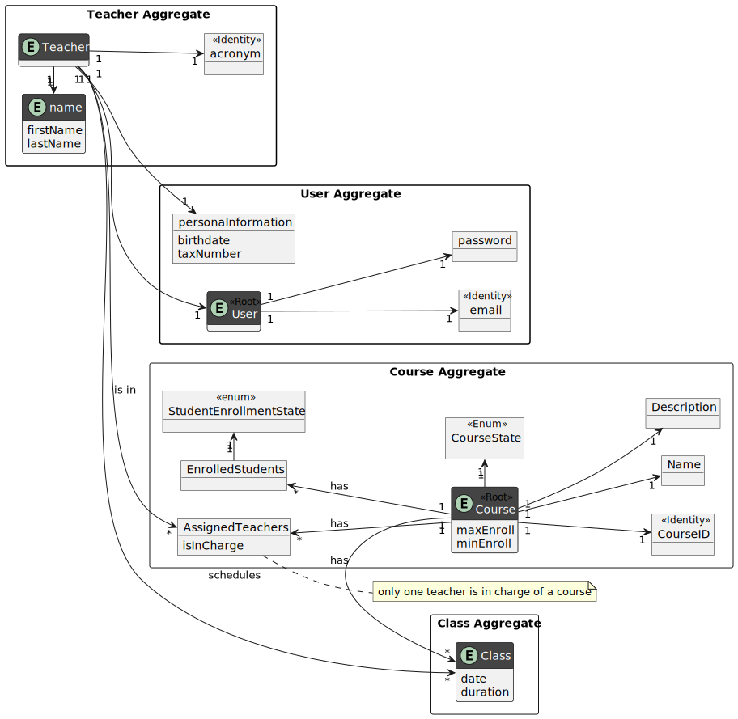
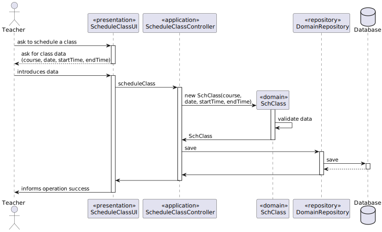
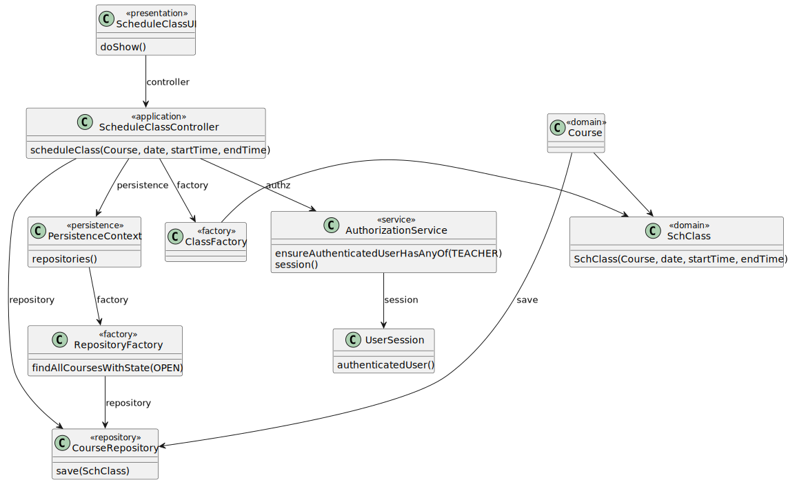
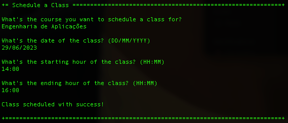
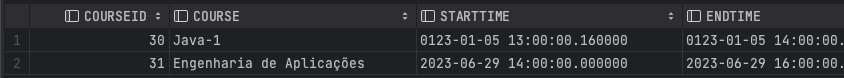

# US 1010 - Schedule a class

*As Teacher, I want to schedule a class*

## 1. Context

*Teachers schedule classes, that are a recurring weekly event.  A class must have a description, date and its starting and ending hour.*

## 2. Requirements

* A teacher can only schedule a class for a course he teaches.
* A teacher can only shcedule a class for a course that is open.
* A teacher can only schedule a class for a time he is available (has no other classes).

## 3. Analysis

### 3.1 Domain Model ###




## 4. Design

*In this sections, the team should present the solution design that was adopted to solve the requirement. This should
include, at least, a diagram of the realization of the functionality (e.g., sequence diagram), a class diagram (
presenting the classes that support the functionality), the identification and rational behind the applied design
patterns and the specification of the main tests used to validade the functionality.*

### 4.1. Sequence Diagram



### 4.2. Class Diagram



### 4.3. Applied Patterns

### 4.4. Tests

**Test 1:** *Verifies that it's possible to schedule a class with valid parameters*

    @Test
    public void validSucess() {
        // Arrange
        String course = "Engenharia de Aplicações";
        Calendar startTime = Calendar.getInstance();
        Calendar endTime = Calendar.getInstance();
        endTime.add(Calendar.HOUR_OF_DAY, 2);

        SchClass schClass = new SchClass(course, startTime, endTime);

        assertNotNull(schClass);
        assertEquals(course, schClass.getCourse());
        assertEquals(startTime, schClass.getStartTime());
        assertEquals(endTime, schClass.getEndTime());
    }

**Test 2-4:** *Verifies that it is not possible to schedule a class without one of the parameters*

    @Test
    public void NullCourseException() {
        String course = null;
        Calendar startTime = Calendar.getInstance();
        Calendar endTime = Calendar.getInstance();
        endTime.add(Calendar.HOUR_OF_DAY, 2);

        assertThrows(IllegalArgumentException.class, () -> new SchClass(course, startTime, endTime));
    }

    @Test
    public void NullStartException() {
        String course = "Bases de Dados";
        Calendar startTime = null;
        Calendar endTime = Calendar.getInstance();
        endTime.add(Calendar.HOUR_OF_DAY, 2);

        assertThrows(IllegalArgumentException.class, () -> new SchClass(course, startTime, endTime));
    }

    @Test
    public void NullEndException() {
        String course = "Matemática Discreta";
        Calendar startTime = Calendar.getInstance();
        Calendar endTime = null;

        assertThrows(IllegalArgumentException.class, () -> new SchClass(course, startTime, endTime));
    }

**Test 5:** *Verifies that two classes with the same parameters are equal*

    @Test
    public void sameAs() {
        // Arrange
        String course = "Física";
        Calendar startTime = Calendar.getInstance();
        Calendar endTime = Calendar.getInstance();
        endTime.add(Calendar.HOUR_OF_DAY, 1);

        SchClass schClass1 = new SchClass(course, startTime, endTime);
        SchClass schClass2 = new SchClass(course, startTime, endTime);

        boolean result = schClass1.sameAs(schClass2);

        assertTrue(result);
    }


## 5. Implementation

**ScheduleClassUI**

```java
public class ScheduleClassUI extends AbstractUI {

    private static final Logger LOGGER = LoggerFactory.getLogger(ScheduleClassUI.class);
    private final ScheduleClassController controller = new ScheduleClassController();

    @Override
    protected boolean doShow() {
        String name = Console.readLine("What's the course you want to schedule a class for?");
        Date openDate = Console.readDate("\nWhat's the date of the class? (DD/MM/YYYY)", "dd/MM/yyyy");
        Date openHour = Console.readDate("\nWhat's the starting hour of the class? (HH:MM)", "hh:mm");
        Date closeHour = Console.readDate("\nWhat's the ending hour of the class? (HH:MM)", "hh:mm");

        Calendar classDateTime = Calendar.getInstance();
        Calendar classEndTime = Calendar.getInstance();
        classDateTime.setTime(openDate);
        classDateTime.set(Calendar.HOUR_OF_DAY, openHour.getHours());
        classDateTime.set(Calendar.MINUTE, openHour.getMinutes());

        classEndTime.setTime(openDate);
        classEndTime.set(Calendar.HOUR_OF_DAY, closeHour.getHours());
        classEndTime.set(Calendar.MINUTE, closeHour.getMinutes());

        if (classDateTime.before(Calendar.getInstance())) {
            System.out.println("\nThe date of the class has already passed. Try again with a future date.\n");
            return false;
        }

        if (classDateTime.after(classEndTime)) {
            System.out.println("\nThe starting hour must be before the ending hour. Try again with valid hours.\n");
            return false;
        }

        try {
            controller.scheduleClass(name, classDateTime, classEndTime);
            System.out.println("\nClass scheduled with success!\n");
        } catch (IntegrityViolationException | ConcurrencyException ex) {
            LOGGER.error("Error performing the operation", ex);
            System.out.println("Unfortunately, there was an unexpected error in the application. " +
                    "Please try again, and if the problem persists, contact your system administrator.");
        }

        return false;
    }

    @Override
    public String headline() {
        return "Schedule a Class";
    }
}
````

**ScheduleClassController**

````
public class ScheduleClassController {
    private final AuthorizationService authz = AuthzRegistry.authorizationService();
    private final ClassRepository classRepository = new ClassRepository();

    public SchClass scheduleClass(String className, Calendar startTime, Calendar endTime) {
        authz.ensureAuthenticatedUserHasAnyOf(BaseRoles.POWER_USER, BaseRoles.ADMIN);

        SchClass classs = new SchClass(className, startTime, endTime);

        return this.classRepository.add(classs);
    }
}
````

## 6. Integration/Demonstration


