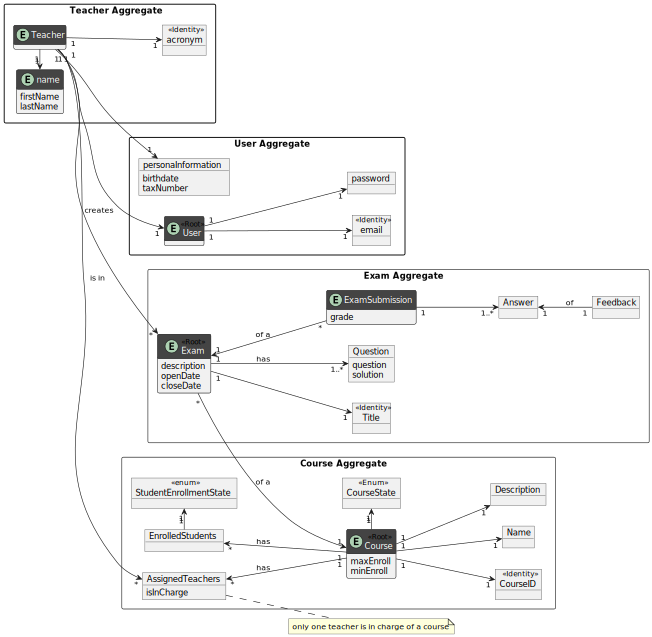
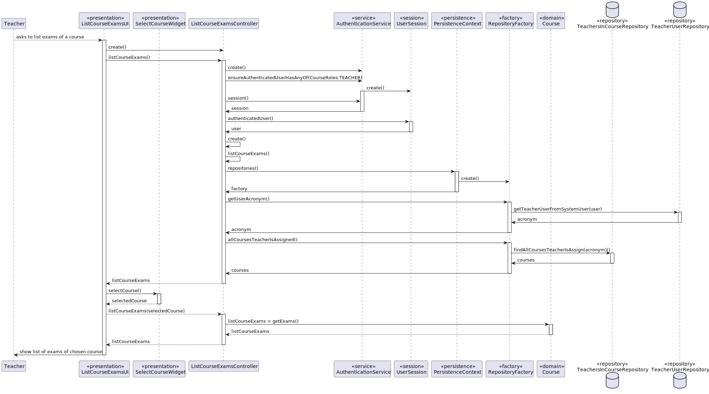
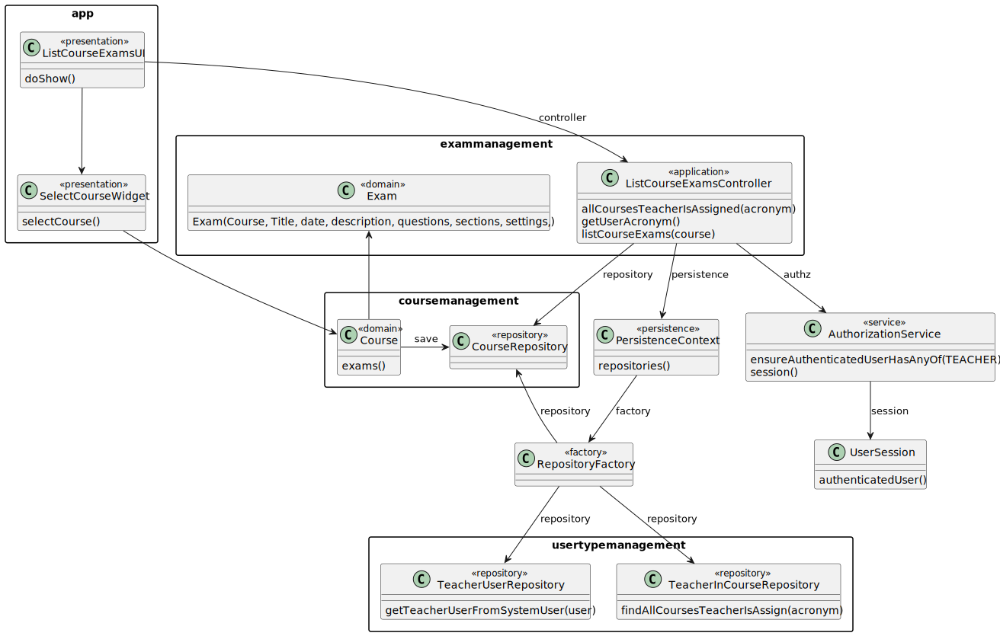
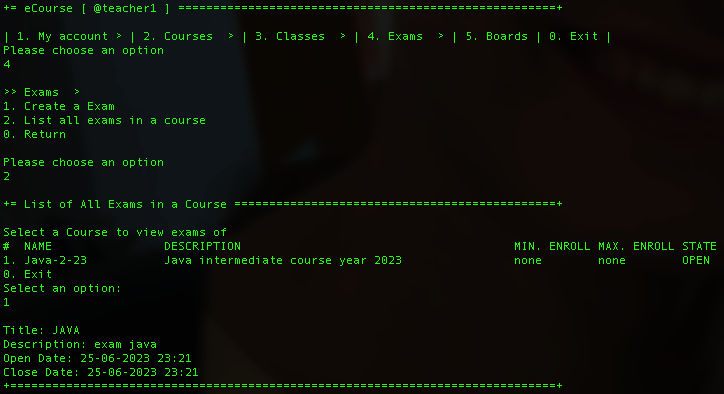
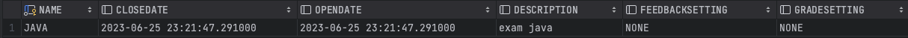

# US 2003 - List all exams in a course

*As Teacher, I want to view a list of all exams in a course*

## 1. Context

*This US aims for a teacher to be able to view a list of all exams in a course. Originally scheduled for implementation during sprint B, the plan was not executed and consequently, it was rescheduled for sprint C.*

## 2. Requirements

This user story is related to the following applications:

- **US 1002:** As Manager, I want to create courses
- **US 1005:** As Manager, I want to set the teachers of a course
- **US 1006:** As User, I want to list all the courses that are available to me
- **US 2001:** As Teacher, I want to create/update an exam

## 3. Analysis



### 4.1. Sequence Diagram



### 4.2. Class Diagram




### 4.3. Applied Patterns

* DDD
* MVC

## 5. Implementation

**ListCourseExamsUI**

```java
public class ListCourseExamsUI extends AbstractUI {
    private final ListCourseExamsController controller = new ListCourseExamsController();
    private final SelectCourseWidget courseWidget = new SelectCourseWidget(controller.allCoursesTeacherIsAssigned(controller.getUserAcronym()));

    @Override
    protected boolean doShow() {
        try {
            System.out.println("Select a Course to view exams of:");
            final Course selectedCourse = courseWidget.selectCourse();
            Iterable<Exam> exams = controller.listCourseExams(selectedCourse);

            if (exams.iterator().hasNext()){
                for (Exam exam: exams) {
                    System.out.println(exam.toString());
                }
            } else {
                System.out.println("There are no exams for this course.");
            }
        } catch (IllegalArgumentException iae) {
            System.out.println(iae.getMessage());
        }
        return true;
    }

    @Override
    public String headline () {
        return "List All Exams in a Course";
    }
}
   ```

**ListCourseExamsController**

```java
@UseCaseController
public class ListCourseExamsController {
    private final AuthorizationService authz = AuthzRegistry.authorizationService();
    private final TeachersInCourseRepository teachersInCourseRepository = PersistenceContext.repositories().teachersInCourse();
    private final TeacherUserRepository teacherUserRepository = PersistenceContext.repositories().teacherUsers();
    
    public Iterable<Course> allCoursesTeacherIsAssigned(Acronym acronym) {
        authz.ensureAuthenticatedUserHasAnyOf(BaseRoles.TEACHER);
        return teachersInCourseRepository.findAllCoursesTeacherIsAssign(acronym);
    }

    public Acronym getUserAcronym(){
        Optional<UserSession> session = authz.session();
        if(session.isEmpty())
            throw new IllegalArgumentException("No user authentication");
        SystemUser user = session.get().authenticatedUser();
        if(!user.roleTypes().contains(BaseRoles.TEACHER))
            throw new IllegalArgumentException("User must be a teacher");
        return teacherUserRepository.getTeacherUserFromSystemUser(user).acronym();
    }

    public Iterable<Exam> listCourseExams(Course course) {
        return course.getExams();
    }
}
```

## 6. Integration/Demonstration

**Demonstration of listing the created exams of a course**



**Table with created exams for course selected**

