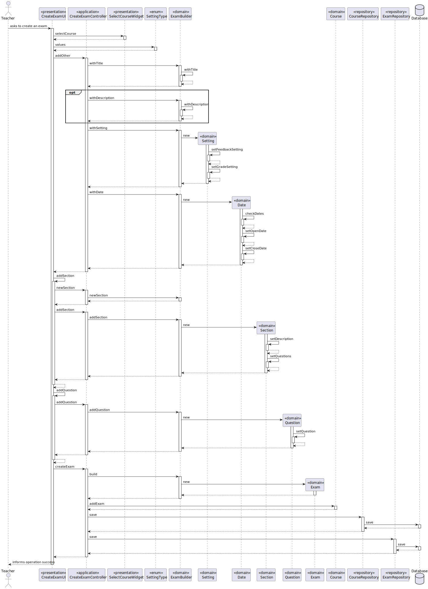
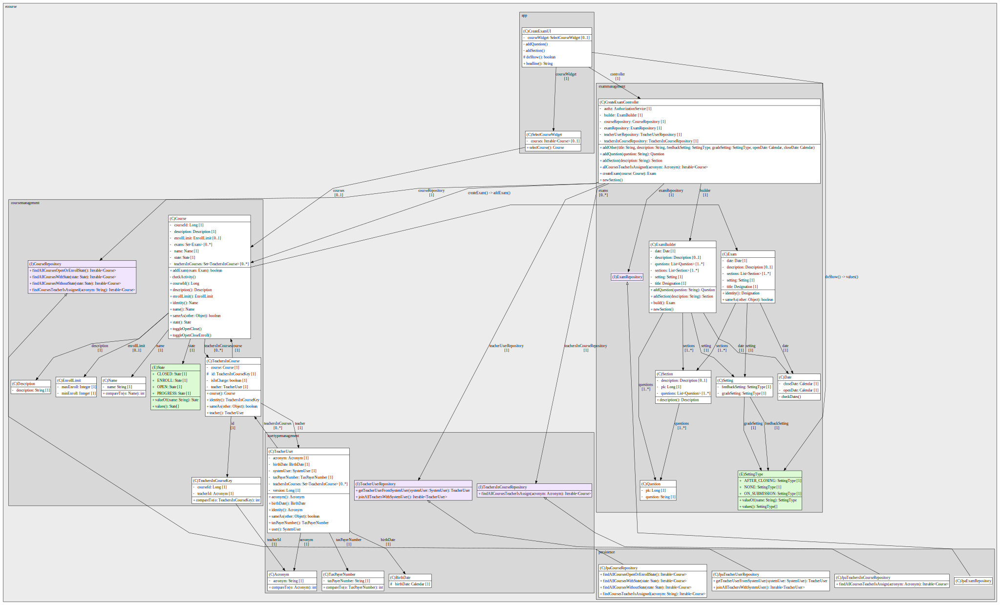
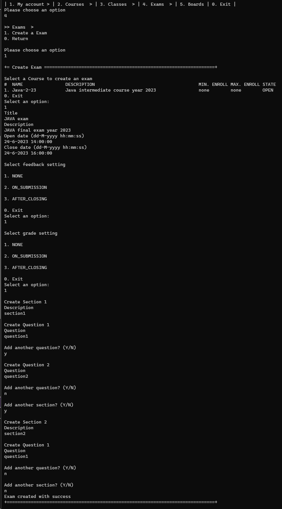
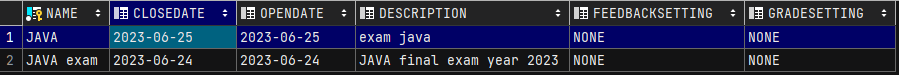
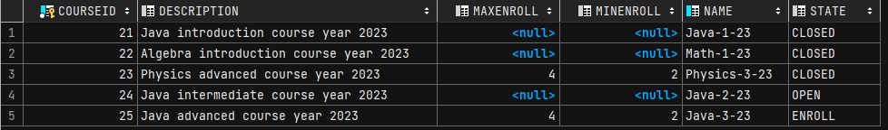
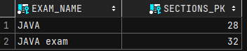
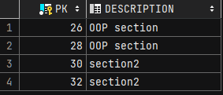
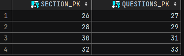
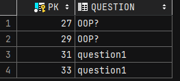

# US 2001 - Create/Update an Exam

*As Teacher, I want to create/update an exam*

## 1. Context

*This US aims to create/update an exam of a course. Originally scheduled for implementation during sprint B, the plan 
was not executed and consequently, it was rescheduled for sprint C.*

## 2. Requirements

* FRE01 - A Teacher creates a new exam. This includes the specification
of the exam (i.e., its structure, in accordance with a grammar for exams that is used to
validate the specification of the exam)
* is related to a specific course
* it has a unique title, header, open and close date and sections.
* header must include global settings:
  * type of feedback (none, on-submission, after-closing)
  * type of grade (none, on-submission, after-closing)
* header, optionally, has a textual description
* open date is the time when students can start to take the exam
* close date is the deadline for students to submit the exam
* must have at least one section
* each section must have at least one question
* section, optionally, has a textual description

## 3. Analysis

* A builder was used to create an exam, as it is a complex object with a nested List

## 4. Design

### 4.1. Realization

*Sequence Diagram*

### 4.2. Class Diagram

*Class Diagram*

### 4.3. Applied Patterns

* DDD
* MVC
* Builder

### 4.4. Tests

**Test 1:** *Verifies that it is not possible to create an instance of Setting with null values*

    @Test(expected = IllegalArgumentException.class)
    public void ensureSettingNotNull() {
        final Setting setting = new Setting(null, null);
    }

**Test 2:** *Verifies that it is not possible to create an instance of Date with null values*

    @Test(expected = IllegalArgumentException.class)
    public void ensureDateNotNull() {
        final Date date = new Date(null, null);
    }

**Test 3:** *Verifies that it is not possible to create an instance of Date with openDate after closeDate*

    @Test(expected = IllegalArgumentException.class)
    public void ensureOpenDateAfterCloseDate() {
        final Date date = new Date(dayAfterTomorrow, tomorrow);
    }

**Test 4:** *Verifies that it is not possible to create an instance of Date with dates in the past*

    @Test(expected = IllegalArgumentException.class)
    public void ensureDatesAreInFuture() {
        Calendar yesterday = Calendar.getInstance();
        yesterday.add(Calendar.DATE, -1);
        Calendar dayBeforeYesterday = Calendar.getInstance();
        dayBeforeYesterday.add(Calendar.DATE, -2);
        final Date date = new Date(dayBeforeYesterday, yesterday);
    }

**Test 5:** *Verifies that it is not possible to create an instance of Exam with null sections*

    @Test(expected = IllegalArgumentException.class)
    public void ensureSectionNotNull() {
        final Exam exam = new Exam(TITLE, DESCRIPTION, SETTING, DATE, null);
    }

**Test 6:** *Verifies that it is not possible to create an instance of Exam with 0 sections*

    @Test(expected = IllegalArgumentException.class)
    public void ensureMinimumOneSection() {
        final Exam exam = new Exam(TITLE, DESCRIPTION, SETTING, DATE, new ArrayList<>());
    }

**Test 7:** *Verifies that it is not possible to create an instance of Section with null description*

    @Test(expected = IllegalArgumentException.class)
    public void ensureSectionDescriptionNotNull() {
        final Section section = new Section(null, QUESTIONS);
    }

**Test 8:** *Verifies that it is not possible to create an instance of Section with null description*

    @Test(expected = IllegalArgumentException.class)
    public void ensureSectionQuestionNotNull() {
        final Section section = new Section(DESCRIPTION, null);
    }

**Test 9:** *Verifies that it is not possible to create an instance of Section with 0 questions*

    @Test(expected = IllegalArgumentException.class)
    public void ensureSectionMinimumOneQuestion() {
        final Section section = new Section(DESCRIPTION, new ArrayList<>());
    }

**Test 10:** *Verifies that it is not possible to create an instance of Question with null question*

    @Test(expected = IllegalArgumentException.class)
    public void ensureQuestionNotNull() {
        final Question question = new Question(null);
    }

**Test 11:** *Verifies that it is not possible to create an instance of Question with empty question*

    @Test(expected = IllegalArgumentException.class)
    public void ensureQuestionNotEmpty() {
        final Question question = new Question("");
    }

## 5. Implementation

**Exam**

    @Entity
    public class Exam implements AggregateRoot<Designation> {
    
        /**
         * Business ID and pk
         */
        @EmbeddedId
        private Designation title;
    
        @Embedded
        private Description description;
    
        /**
         * When feedback and grading is publish
         */
        @Embedded
        private Setting setting;
    
        /**
         * Open and close date
         */
        @Embedded
        private Date date;
    
        /**
         * List of sections with questions
         * Cascade = CascadeType.ALL as sections are part of the same aggregate
         */
        @OneToMany(fetch = FetchType.LAZY, cascade = CascadeType.ALL)
        private List<Section> sections;
    
        protected Exam() {
            //ORM only
        }
    
        /**
         * Constructor
         *
         * @param title         mandatory
         * @param description   optional
         * @param setting       mandatory
         * @param date          mandatory
         * @param sections      mandatory
         */
        public Exam(Designation title, Description description, Setting setting, Date date, List<Section> sections) {
            Preconditions.noneNull(title, setting, date, sections);
            if(sections.size() < 1)
                throw new IllegalArgumentException("There must be latest one section");
            this.title = title;
            this.description = description;
            this.setting = setting;
            this.date = date;
            this.sections = sections;
        }
    
        //getters, setters, equals, hashcode, ...
    }

**Section**

    @Entity
    public class Section implements ValueObject, Serializable {
    
        private static final long serialVersionUID = 1L;
    
        @Id
        @GeneratedValue(strategy = GenerationType.AUTO)
        private Long pk;
    
        private Description description;
    
        /**
         * Cascade = CascadeType.ALL as questions are part of the same aggregate
         */
        @OneToMany(fetch = FetchType.EAGER, cascade = CascadeType.ALL)
        private List<Question> questions;
    
        protected Section() {
            //ORM only
        }
    
        protected Section(Description description, List<Question> questions) {
            setDescription(description);
            setQuestions(questions);
        }
    
        protected void setDescription(Description description) {
            if(StringPredicates.isNullOrEmpty(Objects.toString(description, null)))
                throw new IllegalArgumentException("Description cannot be null or empty");
            this.description = description;
        }
    
        protected void setQuestions(List<Question> questions) {
            Preconditions.noneNull(questions);
            if(questions.size() < 1)
                throw new IllegalArgumentException("There must be latest one question");
            this.questions = questions;
        }
        //getters, equals, hashcode, ...
    }

**Question**

    @Entity
    public class Question implements ValueObject, Serializable {
    
        private static final long serialVersionUID = 1L;
    
        @Id
        @GeneratedValue(strategy = GenerationType.AUTO)
        private Long pk;
    
        private String question;
    
        protected Question() {
            //ORM only
        }
    
        protected Question(String question) {
            setQuestion(question);
        }
    
        protected void setQuestion(String question) {
            if(StringPredicates.isNullOrEmpty(question))
                throw new IllegalArgumentException("Question cannot be null or empty");
            this.question = question;
        }
        //getters, equals, hashcode, ...
    }

**Builder**

    public class ExamBuilder implements DomainFactory<Exam> {
  
        private static final Logger LOGGER = LogManager.getLogger(ExamBuilder.class);
        private Designation title;
        private Description description;
        private Setting setting;
        private Date date;
        private List<Section> sections;
        private List<Question> questions;
    
        public ExamBuilder withTitle(String title) {
            return withTitle(Designation.valueOf(title));
        }
    
        public ExamBuilder withTitle(Designation title) {
            this.title = title;
            return this;
        }
    
        public ExamBuilder withDescription(String description) {
            return withDescription(Description.valueOf(description));
        }
    
        public ExamBuilder withDescription(Description description) {
            this.description = description;
            return this;
        }
    
        public ExamBuilder withSetting(SettingType feedbackSetting, SettingType gradeSetting) {
            this.setting = new Setting(feedbackSetting, gradeSetting);
            return this;
        }
    
        public ExamBuilder withDate(Calendar startDate, Calendar closeDate) {
            this.date = new Date(startDate, closeDate);
            return this;
        }
    
        public Section addSection(String description) {
            Section section = new Section(Description.valueOf(description), questions);
            sections.add(section);
            return section;
        }
    
        public Question addQuestion(String question) {
            Question questionObj = new Question(question);
            questions.add(questionObj);
            return questionObj;
        }
    
        public void newSection() {
            sections = new ArrayList<>();
            questions = new ArrayList<>();
        }
    
        @Override
        public Exam build() {
            Exam exam;
            exam = new Exam(title, description, setting, date, sections);
            if (LOGGER.isDebugEnabled()) {
                LOGGER.debug("Creating new exam");
            }
            return exam;
        }
    }

**Controller**

    @UseCaseController
    public class CreateExamController {
    
        private final AuthorizationService authz = AuthzRegistry.authorizationService();
        private final ExamBuilder builder = new ExamBuilder();
        private final ExamRepository examRepository = PersistenceContext.repositories().exams();
        private final TeachersInCourseRepository teachersInCourseRepository = PersistenceContext.repositories().teachersInCourse();
        private final TeacherUserRepository teacherUserRepository = PersistenceContext.repositories().teacherUsers();
        private final CourseRepository courseRepository = PersistenceContext.repositories().courses();
    
    
        public Exam createExam(Course course) {
            authz.ensureAuthenticatedUserHasAnyOf(BaseRoles.POWER_USER, BaseRoles.TEACHER);
            Exam exam = builder.build();
            course.addExam(exam);
            courseRepository.save(course);
            return this.examRepository.save(exam);
        }
    
        //todo refactor to avoid code duplication
        public Iterable<Course> allCoursesTeacherIsAssigned(Acronym acronym) {
            authz.ensureAuthenticatedUserHasAnyOf(BaseRoles.TEACHER);
            return teachersInCourseRepository.findAllCoursesTeacherIsAssign(acronym);
        }
    
        public Acronym getUserAcronym(){
            Optional<UserSession> session = authz.session();
            if(session.isEmpty())
                throw new IllegalArgumentException("No user authentication");
            SystemUser user = session.get().authenticatedUser();
            if(!user.roleTypes().contains(BaseRoles.TEACHER))
                throw new IllegalArgumentException("User must be a teacher");
            return teacherUserRepository.getTeacherUserFromSystemUser(user).acronym();
        }
    
        public void addOther(String title, String description, SettingType feedbackSetting, SettingType gradeSetting,
                        Calendar openDate, Calendar closeDate) {
            builder.withTitle(title);
            builder.withDescription(description);
            builder.withSetting(feedbackSetting, gradeSetting);
            builder.withDate(openDate, closeDate);
        }
    
        public Question addQuestion(String question) {
            return builder.addQuestion(question);
        }
    
        public void newSection() {
            builder.newSection();
        }
    
        public Section addSection(String description) {
            return builder.addSection(description);
        }
    }

**JPA repository**

    public class JpaExamRepository
    extends JpaAutoTxRepository<Exam, Designation, Designation>
    implements ExamRepository {
    
        public JpaExamRepository(final TransactionalContext autoTx) {
            super(autoTx, "title");
        }
    
        public JpaExamRepository(final String puname) {
            super(puname, Application.settings().getExtendedPersistenceProperties(), "title");
        }
    
    }

## 6. Integration/Demonstration

*Exam Creation*

*Exam*

*Course*

*Exams of a Course*

*Sections of a Exam*

*Sections*

*Questions of a section*

*Questions*

## 7. Observations

A DTO could be used to decouple the UI from course