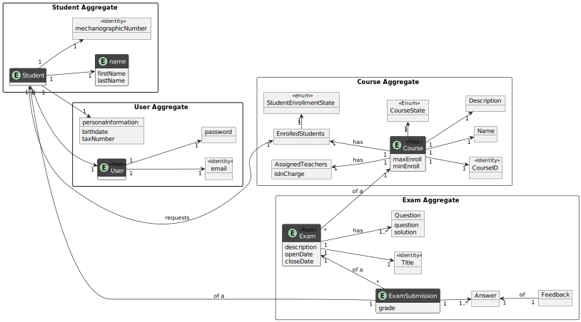

# US 2002 - To view a list of my future exams

*As Student, I want to view a list of my future exams*

## 1. Context

For this user story, students need to be able to view a list of their future exams. Each exam is related to **one** course and has a **title**, **description**, **open** and **close** dates, **questions** and **sections**.

## 2. Requirements

*This user story has the following dependencies on the previous functionalitites:*

**US1008:** As Student, I want to request my enrollment in a course, since a student needs to be in a course in order to take an exam

**US1009:** As Manager, I want to approve or reject students applications to courses, since he needs to be accepted to be in a course

**US2001:** As Teacher, I want to create/update an exam, the exam needs to be created in order to be taken by a student

## 3. Analysis



## 4. Design

### 4.1. Sequence Diagram


### 4.2. Class Diagram


### 4.3. Applied Patterns

### 4.4. Tests

**Tests 1-3:** *This are some tests from the exam class, since this is a listing implementation, it would be shown in the presentation of Sprint C.*

```
    @Test(expected = IllegalArgumentException.class)
    public void ensureDateNotNull() {
        final Date date = new Date(null, null);
    }

    @Test(expected = IllegalArgumentException.class)
    public void ensureOpenDateAfterCloseDate() {
        final Date date = new Date(dayAfterTomorrow, tomorrow);
    }

    @Test(expected = IllegalArgumentException.class)
    public void ensureDatesAreInFuture() {
        Calendar yesterday = Calendar.getInstance();
        yesterday.add(Calendar.DATE, -1);
        Calendar dayBeforeYesterday = Calendar.getInstance();
        dayBeforeYesterday.add(Calendar.DATE, -2);
        final Date date = new Date(dayBeforeYesterday, yesterday);
    }
````

## 5. Implementation

**ListStudentExamsUI**

```java
public class ListStudentExamsUI extends AbstractUI {

    private final ListStudentExamsController controller = new ListStudentExamsController();

    @Override
    protected boolean doShow() {

        try {
            Iterable<Course> userCourses = controller.userCourses();
            Iterable<Exam> exams = controller.listExams(userCourses);

            for (Exam exam : exams) {
                System.out.println(exam);
            }
        } catch (IllegalArgumentException iae) {
            System.out.println(iae.getMessage());
        }

        return true;
    }

    @Override
    public String headline() {
        return "List my future exams";
    }
}
```

**ListStudentExamsController**

```java
@UseCaseController
public class ListStudentExamsController
{
    private final AuthorizationService authz = AuthzRegistry.authorizationService();
    private final ClientUserRepository clientUserRepository = PersistenceContext.repositories().clientUsers();
    private final StudentsInCourseRepository studentsInCourseRepository = PersistenceContext.repositories().studentsInCourse();

    public Iterable<Course> userCourses(){
        StudentUser studentUser = clientUserRepository.findByUsername(authz.session().get().authenticatedUser().username()).get();
        Iterable<Course> studentCourses = studentsInCourseRepository.findAllCoursesStudentIsAssign(studentUser.mecanographicNumber());
        return studentCourses;
    }

    public Iterable<Exam> listExams(Iterable<Course> courses) {
        Set<Exam> commonExams = null;
        boolean firstCourse = true;

        for (Course course : courses) {
            Set<Exam> exams = course.getExams();

            if (firstCourse) {
                commonExams = new HashSet<>(exams);
                firstCourse = false;
            } else {
                commonExams.retainAll(exams);
            }
        }

        return commonExams;
    }
}

```
## 6. Integration/Demonstration


**Demonstração da funcionalidade**


**Demonstração da Base de Dados (Exames)**


**Demonstração da Base de Dados (Exanes nos Cursos)**