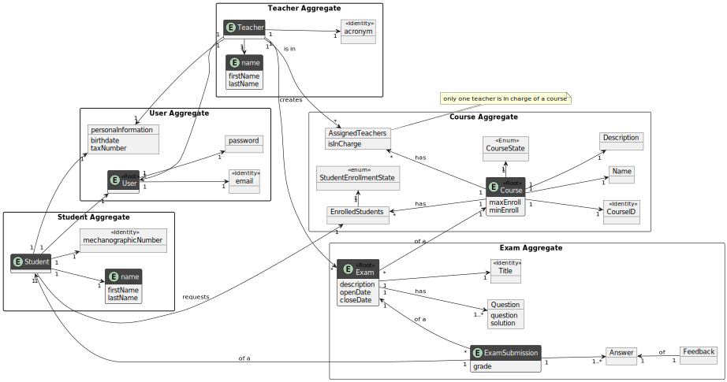
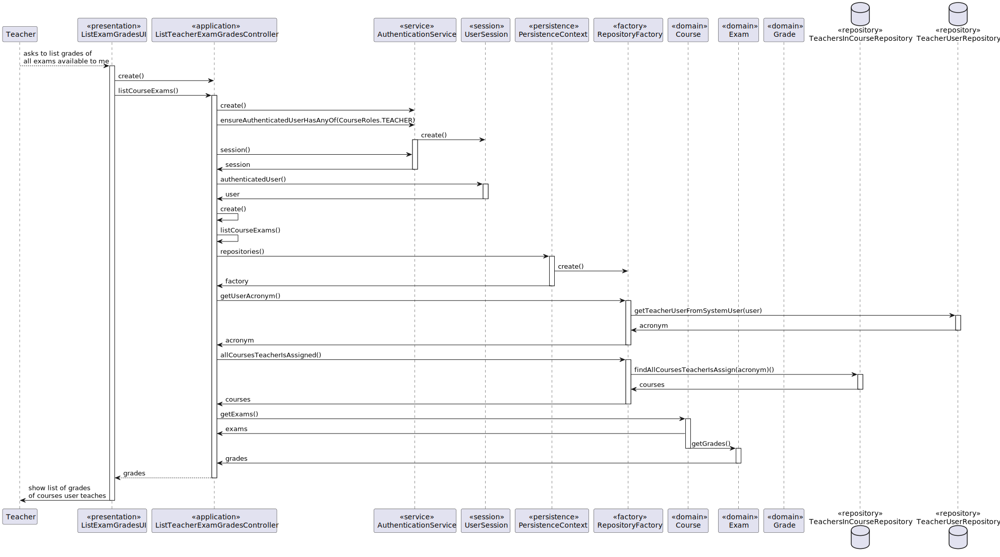
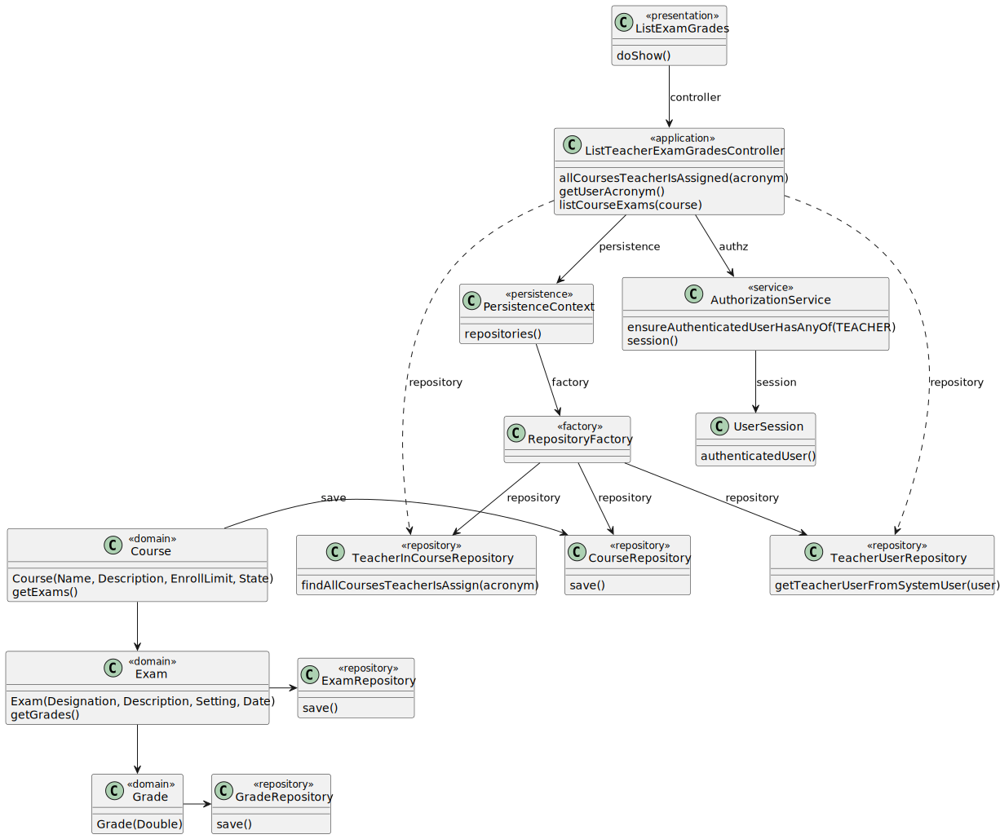
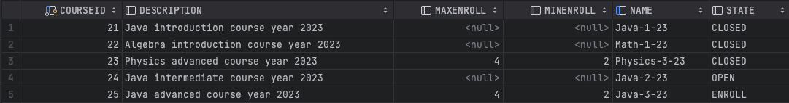
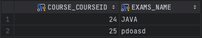
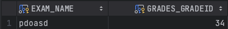
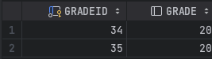
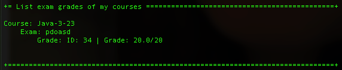

# US 2006 - View grades of exams

*As Teacher, I want to view a list of the grades of exams of my courses*

## 1. Context

*According to US2004, a student can take an exam and the system will automatically give them feedback and a grade. This 
User Story aims to implementate a function that makes it possible for a teacher to be able to see all the grades of
all the students of all the exams of all the courses he is teaching.*

## 2. Requirements

*This User Story is reliant on:*

**US 1002:** As a Manager, I want to create a course, for a course to be available to both students and teachers.

**US 1005:** As a Manager, I want to assign a teacher to a course.

**US 1009:** As a Manager, I want to assign a student to a course.

**US 2001:** As a Teacher, I want to create an exam, so that an exam can be evaluated.

**US 2004:** As a Student, I want to take an exam, so that an exam grade is registered.


## 3. Analysis



## 4. Design

### 4.1. Sequence Diagram



### 4.2. Class Diagram



### 4.3. Applied Patterns

* DDD
* Repository
* Authorization

## 5. Implementation

**ListExamGradesUI**

```java
public class ListExamGradesUI extends AbstractUI {
    private final ListTeacherExamGradesController controller = new ListTeacherExamGradesController();

    @Override
    protected boolean doShow() {
        controller.findAllTeacherExams();
        return true;
    }

    @Override
    public String headline() {
        return "List exam grades of my courses";
    }
}
   ```

**ListTeacherExamGradesController**

```java
@UseCaseController
public class ListTeacherExamGradesController{
    private final AuthorizationService authz = AuthzRegistry.authorizationService();
    private final TeachersInCourseRepository teachersInCourseRepository = PersistenceContext.repositories().teachersInCourse();
    private final TeacherUserRepository teacherUserRepository = PersistenceContext.repositories().teacherUsers();

    public Iterable<Exam> findAllTeacherExams() {
        authz.ensureAuthenticatedUserHasAnyOf(BaseRoles.ADMIN, BaseRoles.POWER_USER, BaseRoles.TEACHER);
        List<Exam> teacherExams = new ArrayList<>();

        for (Course x : teachersInCourseRepository.findAllCoursesTeacherIsAssign(getUserAcronym().acronym())) {
            System.out.println("Course: "+ x.name().toString());
            for (Exam e : x.getExams()) {
                System.out.println("    Exam: " + e.getTitle().toString());
                for (Grade g : e.getGrades()) {
                    System.out.println("        Grade: " + g.toString());
                }
                teacherExams.add(e);
            }
        }
        return teacherExams;
    }
    public TeacherUser getUserAcronym() {
        Optional<UserSession> session = authz.session();
        SystemUser user = session.get().authenticatedUser();
        return teacherUserRepository.getTeacherUserFromSystemUser(user);
    }
}
```

## 6. Integration/Demonstration






