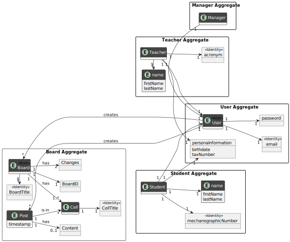
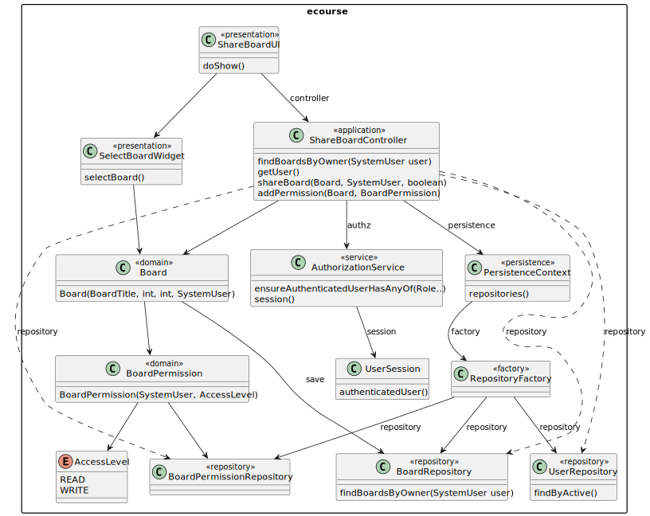

# US 3004 - To share a board

*As User, I want to share a board*

## 1. Context

*The goal of this User Story is for a user to be able to select one of the boards he is an owner of and share it with an
user registered in the system, with the permissions read or write.*

## 2. Requirements

*This functionality is dependent in the following user story:*

**US 3002** As User, I want to create a board, since a board is needed for it to be shared.

*The following requirements are needed for this functionality:*

- All users can execute this functionality.
- An user cannot already have the permissions to read or write in the board.


## 3. Analysis



## 4. Design

### 4.1. Sequence Diagram


### 4.2. Class Diagram



### 4.3. Applied Patterns

* DDD - Domain Driven Design

### 4.4. Tests

**Test 1-2:** *Verifies the BoardPermission class, its creation and if two equally created are the same.*

```
@Test
    public void createBoardPermissionTest() {
        AccessLevel accessLevel = AccessLevel.READ;

        BoardPermission boardPermission = new BoardPermission(getNewDummyUser(), accessLevel);

        Assertions.assertEquals(getNewDummyUser(), boardPermission.userWithPermission());
        Assertions.assertEquals(accessLevel, boardPermission.accessLevel());
    }

    @Test
    public void assertEqualsBoardPermissions() {
        AccessLevel accessLevel = AccessLevel.READ;

        BoardPermission boardPermission1 = new BoardPermission(getNewDummyUser(), accessLevel);
        BoardPermission boardPermission2 = new BoardPermission(getOtherDUmmyUser(), accessLevel);

        Assertions.assertEquals(boardPermission1, boardPermission2);
        Assertions.assertEquals(boardPermission1.hashCode(), boardPermission2.hashCode());
    }
````

**Test 3:** *Verifies the creation of a board.*

```
@BeforeEach
    void setup() {
        boardTitle = new BoardTitle("Test Board");
        numberRows = 5;
        numberColumns = 5;
        boardOwner = getNewDummyUser();
    }

    @Test
    public void createBoard() {

        BoardFactory boardFactory = new BoardFactory();
        Set<BoardCell> allBoardEntrys = new HashSet<>();
        Board board = boardFactory.create(String.valueOf(boardTitle), numberRows, numberColumns, allBoardEntrys, boardOwner);

        Assertions.assertEquals(boardTitle, board.identity());
        Assertions.assertEquals(numberRows, board.getNumberRows());
        Assertions.assertEquals(numberColumns, board.getNumberColumns());
        Assertions.assertEquals(BoardState.OPEN, board.state());
        Assertions.assertEquals(boardOwner, board.boardOwner());
    }
````

## 5. Implementation

**ShareBoardUI**

```java
public class ShareBoardUI extends AbstractUI {
    private final ShareBoardController controller = new ShareBoardController();
    private final SelectBoardWidget boardWidget = new SelectBoardWidget(controller.findBoardsByOwner(controller.getUser()));
    private final UserRepository repository = PersistenceContext.repositories().users();
    @Override
    protected boolean doShow() {

        System.out.println("Select a Board to share");
        final Board selectedBoard = boardWidget.selectBoard();
        if (selectedBoard == null)
            return false;

        try{
            
            SystemUser shareUser = null;
            while (shareUser == null) {
                String username = Console.readLine("Enter the username of the user to share the board with: ");
                for (SystemUser user : repository.findByActive(true)) {
                    if (user.username().toString().equals(username)) {
                        shareUser = user;
                        break;
                    }
                }
                if (shareUser == null) {
                    System.out.println("User not found. Please try again.");
                }
            }

            String option = Console.readLine("Do you want to give them read or write permissions? (R/W)");
            if (option.equalsIgnoreCase("R")){
                controller.shareBoard(selectedBoard, shareUser, false);
                selectedBoard.addPermission(new BoardPermission(controller.getUser(), AccessLevel.READ));
                System.out.println("Board sucessfully shared with" + shareUser.username() + "with" + AccessLevel.READ + "permissions."); }
            else if (option.equalsIgnoreCase("W")){
                selectedBoard.addPermission(new BoardPermission(controller.getUser(), AccessLevel.WRITE));
                System.out.println("Board sucessfully shared with" + shareUser.username().toString() + "with" + AccessLevel.WRITE + "permissions."); }
            else {
                throw new IllegalArgumentException("Invalid option");
            }

        } catch (IllegalArgumentException e){
            System.out.println(e.getMessage());
        } catch (IntegrityViolationException e){
            System.out.println("That user already has access to this board");
        }

        return true;
    }

    @Override
    public String headline() {
        return "Share a board";
    }
}
   ```
**SelecBoardWidget**

```java
public class SelectBoardWidget {

    private final Iterable<Board> boards;

    public SelectBoardWidget(Iterable<Board> boards) {
        this.boards = boards;
    }
    
    public Board selectBoard() {
        if (!boards.iterator().hasNext()) {
            System.out.println("There are no courses available");
            return null;
        }
        final SelectWidget<Board> selector = new SelectWidget<>(BoardsPrinter.HEADER, boards, new BoardsPrinter());
        selector.show();
        return selector.selectedElement();
    }
}
```

**BoardsPrinter**

```java
public class BoardsPrinter implements Visitor<Board> {
    public final static String SPACING = "%-20s%-50s%-12s%-12s";
    public final static String HEADER = String.format("#  " + SPACING, "TITLE", "NUM. COLUMNS", "NUM. ROWS", "STATE");

    @Override
    public void visit(final Board visitee) {
        System.out.printf(SPACING, visitee.identity(), visitee.getNumberColumns(), visitee.getNumberRows(), visitee.state());
    }
}

```


**ShareBoardController**

```java
@UseCaseController
public class ShareBoardController{
    private final AuthorizationService authz = AuthzRegistry.authorizationService();
    private final BoardRepository repo = PersistenceContext.repositories().boards();

    public Iterable<Board> findBoardsByOwner(SystemUser user) {
        authz.ensureAuthenticatedUserHasAnyOf(BaseRoles.TEACHER, BaseRoles.POWER_USER, BaseRoles.ADMIN, BaseRoles.STUDENT);
        return repo.findByOwner(user);
    }

    public SystemUser getUser(){
        Optional<UserSession> session = authz.session();
        if(session.isEmpty())
            throw new IllegalArgumentException("No user authentication");
        SystemUser user = session.get().authenticatedUser();
        return user;
    }

    public void shareBoard(Board board, SystemUser user, boolean write){
        if (write == true) {
            addPermission(board, new BoardPermission(user, AccessLevel.WRITE));
        } else if (write == false){
            addPermission(board, new BoardPermission(user, AccessLevel.READ));
        }
    }

    public void addPermission(Board board, final BoardPermission boardPermissionp) {
        board.addPermission(boardPermissionp);
        board.addLog(new Log("Permissions added: " + boardPermissionp.toString()));
        repo.save(board);
    }
}
```

## 6. Integration/Demonstration


**Board selection and sharing demonstration**


**Database demonstration**
