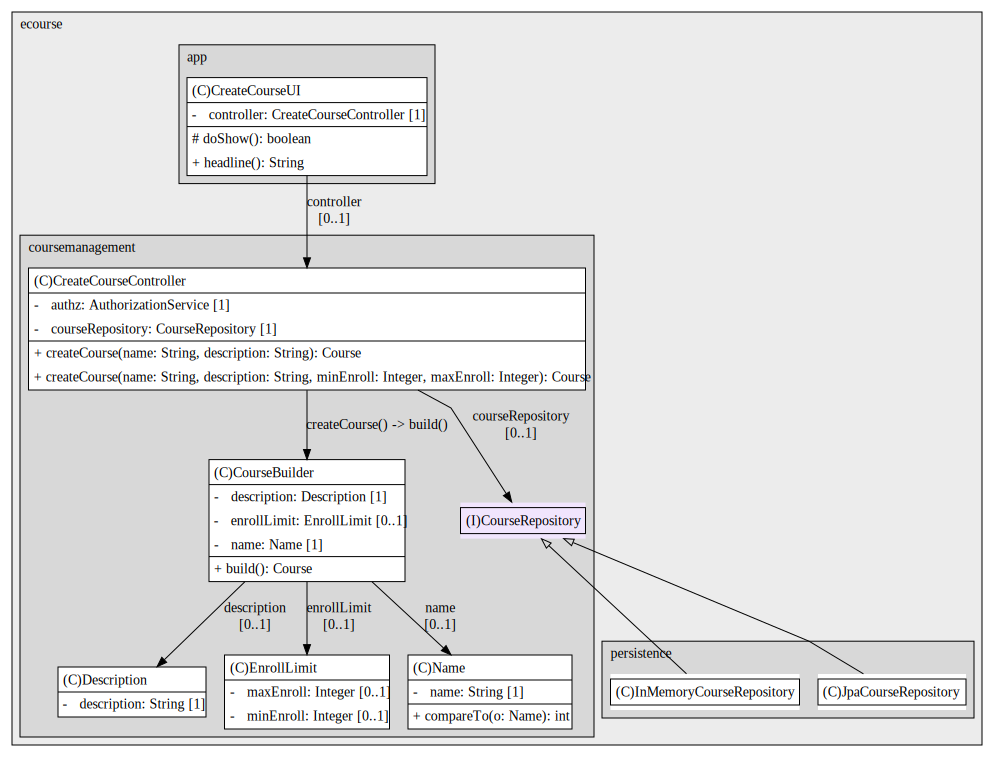
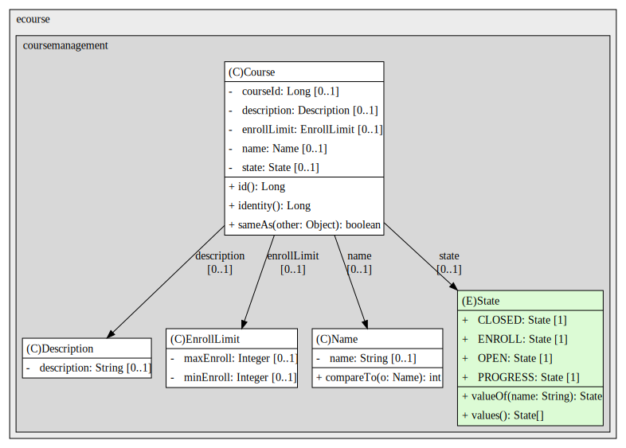
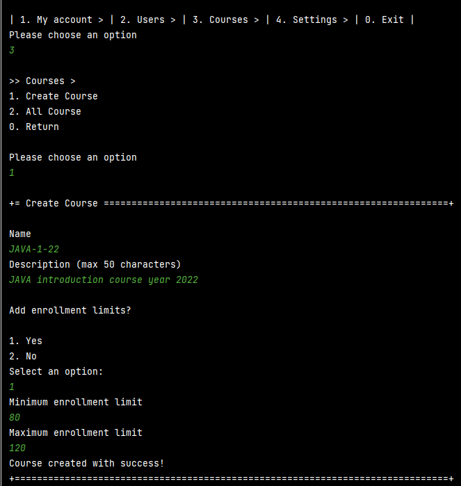
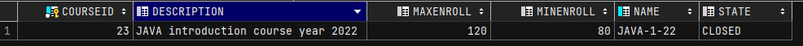

# US 1002 - Create Courses

As Manager, I want to create courses.

## 1. Context

The goal of this US is to generate a Course and store it within the database.

## 2. Requirements

* FRC01 - Create Course Different editions of a course are to be considered different courses (e.g., Intro-Math-Sem01,
  Intro-Math Sem02).
* FRC01 - Only managers are able to execute this functionality.
* Automatically generated identifier
* Unique Name
* Description has characters limit, defined in configuration file
* Optionally, has enrollment limits
* Created in "close" state

## 3. Analysis

## 4. Design

### 4.1. Realization

### 4.2. Class Diagram


*Class Diagram*

*Course Class Diagram*

### 4.3. Applied Patterns

* Builder
* DDD

### 4.4. Tests

**Test 1:** *Verifies that it is not possible to create an instance of the Example class with null values.*

```
@Test(expected = IllegalArgumentException.class)
public void ensureNullIsNotAllowed() {
	Example instance = new Example(null, null);
}
````

## 5. Implementation

*In this section the team should present, if necessary, some evidencies that the implementation is according to the
design. It should also describe and explain other important artifacts necessary to fully understand the implementation
like, for instance, configuration files.*

*It is also a best practice to include a listing (with a brief summary) of the major commits regarding this
requirement.*

## 6. Integration/Demonstration




## 7. Observations

*This section should be used to include any content that does not fit any of the previous sections.*

*The team should present here, for instance, a critical prespective on the developed work including the analysis of
alternative solutioons or related works*

*The team should include in this section statements/references regarding third party works that were used in the
development this work.*