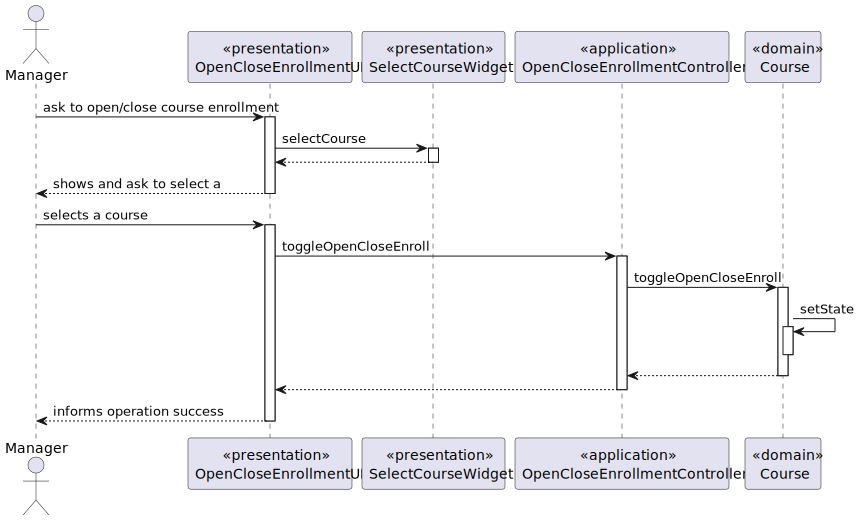
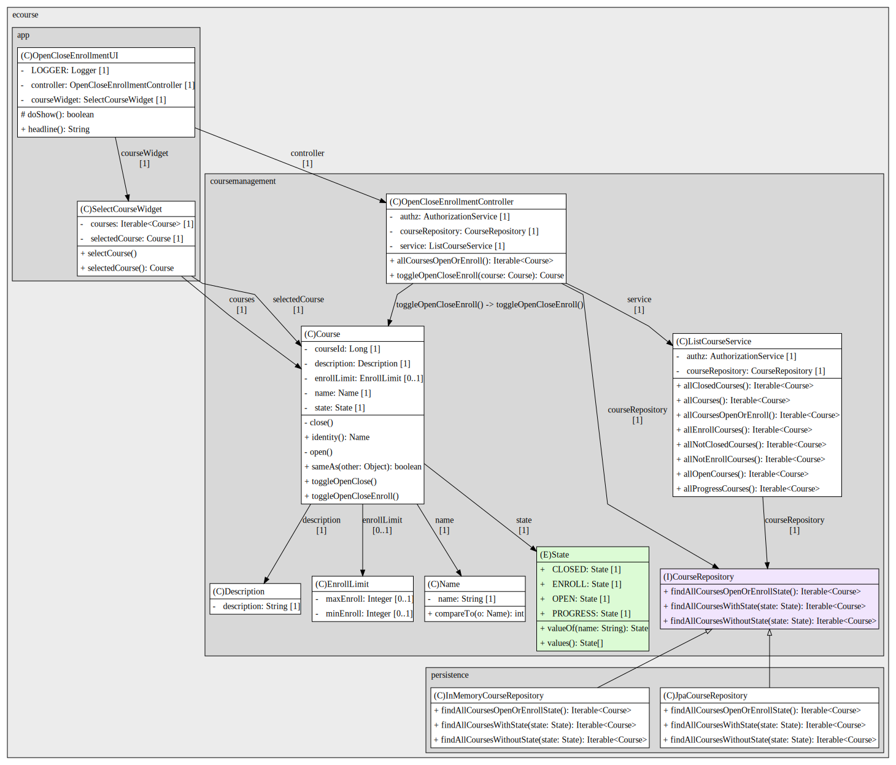
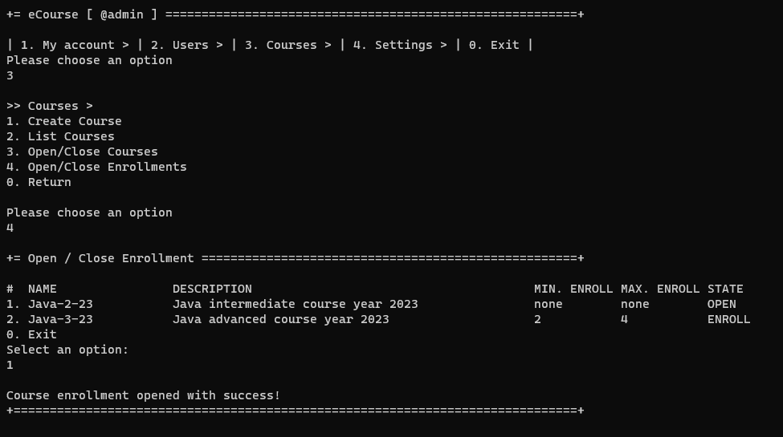
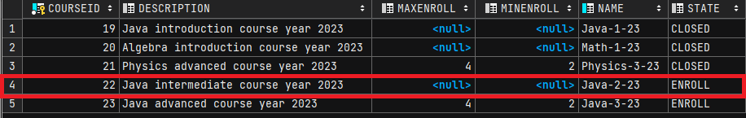

# US 1003 - Open and close enrollments in courses

As Manager, I want to open and close enrollments in courses.

## 1. Context

The goal of this US is to change the state of a course from 'open' to 'enroll', and 'enroll' to 'open'.
While in state 'enroll', students can request to enroll in that course.

## 2. Requirements

* FRC02 - Only managers are able to execute this functionality
* A course must be in state open to open enrollments (refer to us_1004)
* To close enrollment, change back to open

## 3. Analysis

...

## 4. Design

### 4.1. Realization

*System Diagram*

### 4.2. Class Diagram

*Class Diagram*

### 4.3. Applied Patterns

### 4.4. Tests

**Test1:** *verifies that a course in state open toggles to enrollment*  

    @Test
    public void ensureToggleEnrollmentOpenToEnroll() {
        Course course1 = new CourseBuilder().withName("Java-1").withDescription("Java intro 22").withEnrollLimit(80, 120).build();
        course1.setState(State.OPEN);
        course1.toggleOpenCloseEnroll();
        assertEquals(course1.getState(), State.ENROLL);
    }

**Test2:** *verifies that a course in state enroll toggles to enrollment*

    @Test
    public void ensureToggleEnrollmentEnrollToOpen() {
        Course course1 = new CourseBuilder().withName("Java-1").withDescription("Java intro 22").withEnrollLimit(80, 120).build();
        course1.setState(State.ENROLL);
        course1.toggleOpenCloseEnroll();
        assertEquals(course1.getState(), State.OPEN);
    }

**Test3:** *verifies that a course in state closed cannot toggle*

    @Test(expected = IllegalStateException.class)
    public void ensureToggleEnrollmentCannotToggleClosed() {
        Course course1 = new CourseBuilder().withName("Java-1").withDescription("Java intro 22").withEnrollLimit(80, 120).build();
        course1.setState(State.CLOSED);
        course1.toggleOpenCloseEnroll();
    }

**Test4:** *verifies that a course in state progress cannot toggle*

    @Test(expected = IllegalStateException.class)
    public void ensureToggleEnrollmentCannotToggleProgress() {
        Course course1 = new CourseBuilder().withName("Java-1").withDescription("Java intro 22").withEnrollLimit(80, 120).build();
        course1.setState(State.PROGRESS);
        course1.toggleOpenCloseEnroll();
    }

## 5. Implementation

**Course:** *toggle enrollments*

    /**
     * Toggles course state between open and enroll.
     */
    public void toggleOpenCloseEnroll() {
        if (this.state.equals(State.OPEN)) {
            this.setState(State.ENROLL);
        } else if (this.state.equals(State.ENROLL)) {
            this.setState(State.OPEN);
        } else {
            throw new IllegalStateException("Cannot open/close enrollment of a course that is closed or in progress");
        }
    }

**Controller** *list toggleable courses, toggle course*

    public Iterable<Course> allCoursesOpenOrEnroll() {
        return service.allCoursesOpenOrEnroll();
    }

    public Course toggleOpenCloseEnroll(Course course) {
        authz.ensureAuthenticatedUserHasAnyOf(BaseRoles.POWER_USER, BaseRoles.ADMIN);
        if (course == null) throw new IllegalArgumentException();
        course.toggleOpenCloseEnroll();
        return courseRepository.save(course);
    }

## 6. Integration/Demonstration

## 7. Observations

No observations