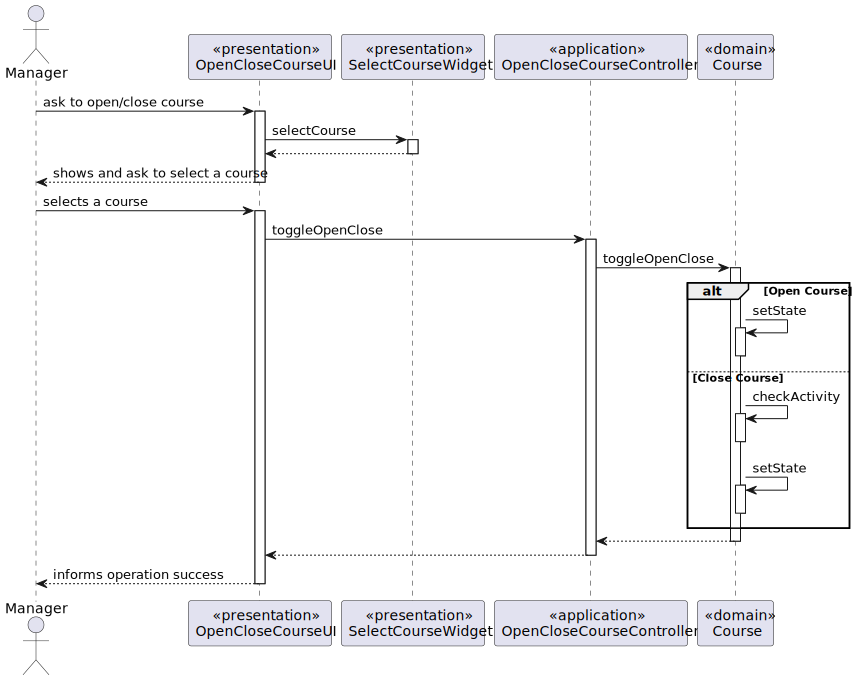
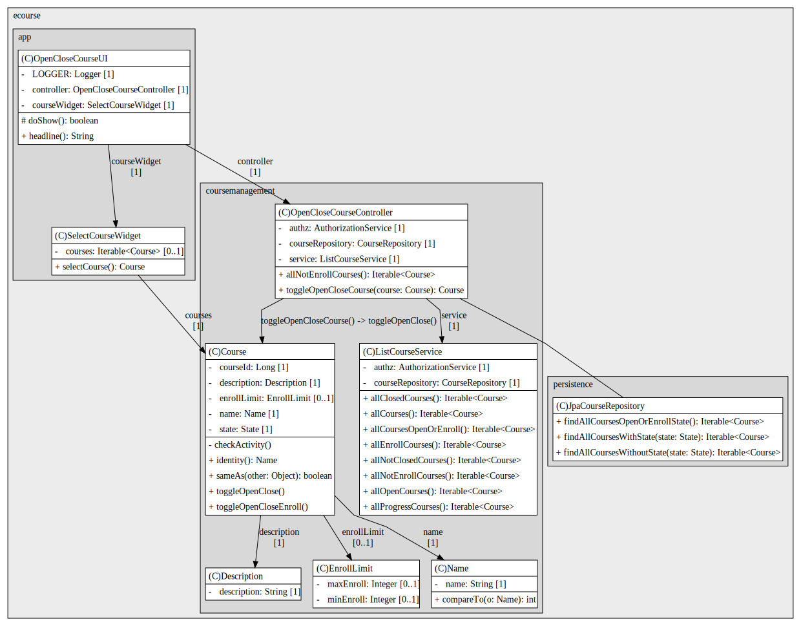
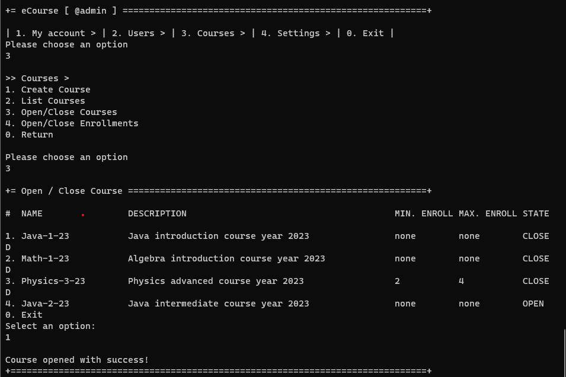
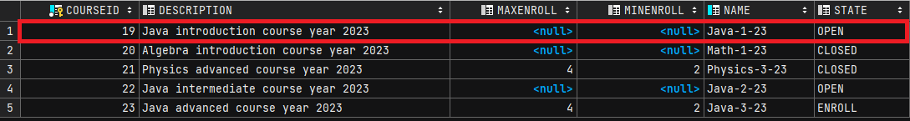

# US 1004 - Open and close courses

As Manager, I want to open and close courses.

## 1. Context

This US aims to change the state of a course to open/close

## 2. Requirements

* FRC02 - Only managers are able to execute this functionality
* Toggle between open and closed or progress and closed state
* Closed course cannot have any activities(exams, classes, etc...)

## 3. Analysis

...

## 4. Design

### 4.1. Realization

*System Diagram*

### 4.2. Class Diagram

*Class Diagram*

### 4.3. Applied Patterns

### 4.4. Tests

**Test 1:** *Verifies that it is not possible to create an instance of the Example class with null values.*

    @Test
    public void ensureToggleOpenToClose() {
        Course course1 = new CourseBuilder().withName("Java-1").withDescription("Java intro 22").withEnrollLimit(80, 120).build();
        course1.setState(State.OPEN);
        course1.toggleOpenClose();
        assertEquals(course1.getState(), State.CLOSED);
    }

    @Test
    public void ensureToggleCloseToOpen() {
        Course course1 = new CourseBuilder().withName("Java-1").withDescription("Java intro 22").withEnrollLimit(80, 120).build();
        course1.setState(State.CLOSED);
        course1.toggleOpenClose();
        assertEquals(course1.getState(), State.OPEN);
    }

    @Test(expected = IllegalStateException.class)
    public void ensureToggleCannotToggleEnroll() {
        Course course1 = new CourseBuilder().withName("Java-1").withDescription("Java intro 22").withEnrollLimit(80, 120).build();
        course1.setState(State.ENROLL);
        course1.toggleOpenClose();
    }

    @Test//(expected = IllegalStateException.class)
    public void ensureToggleCannotToggleToClosedWithActivity() {
        //TODO, not implemented yet
    }

## 5. Implementation

    /**
     * Toggles course state between open and Close. Can only toggle to open if course has no activity
     */
    public void toggleOpenClose() {
        if (this.state.equals(State.CLOSED)) {
            this.setState(State.OPEN);
        } else if (this.state.equals(State.OPEN) || this.state.equals(State.PROGRESS)) {
            checkActivity();
            this.setState(State.CLOSED);
        } else {
            throw new IllegalStateException("Cannot open/close course that is in enrollment or progress");
        }
    }

    /**
     * checks if course as activity(schelude exams or extra classes).
     * @throws IllegalStateException case course as activity
     */
    private void checkActivity() throws IllegalStateException{
        //todo check activity
    }

## 6. Integration/Demonstration

## 7. Observations

The feature to prevent a course from closing when there is ongoing activity (such as exams or extra classes) 
has not been implemented yet, as these activities are not currently implemented. 
This issue will be addressed in a future sprint when the activities are implemented