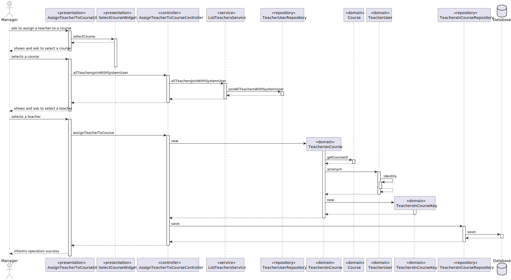
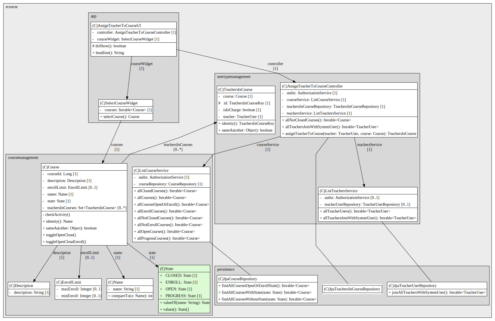
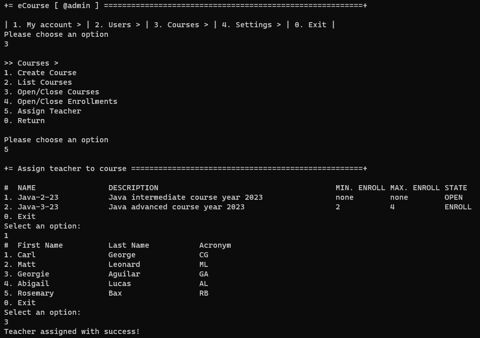
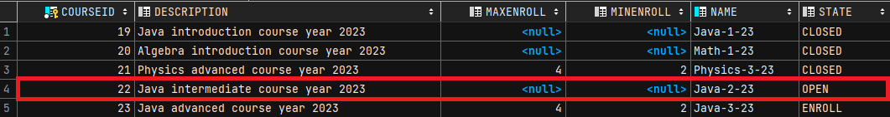
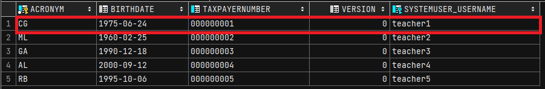
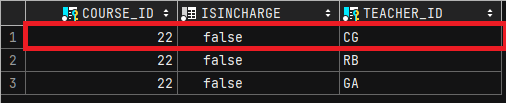

# US 1005 - Set the teachers of a course

*As Manager, I want to set the teachers of a course*

## 1. Context

*This US aims to assign teachers to a course and designate a lead teacher*

## 2. Requirements

* FRC04 - Each course may have several teachers and must have only one Teacher in Charge. 
* FRC04 - Only managers are able to execute this functionality
* Should only assign teachers to open courses

## 3. Analysis

...

## 4. Design

### 4.1. Realization

*Sequence Diagram*

### 4.2. Class Diagram

*Class Diagram*

### 4.3. Applied Patterns

### 4.4. Tests

**Test 1:** *Verifies that it is not possible to assign a teacher to a course that is in state closed.*

    @Test(expected = IllegalStateException.class)
    public void ensureTeacherInCourseFailsClosedCourse() {
        Calendar birthdate = Calendar.getInstance();
        birthdate.add(Calendar.DATE, -1);
        final Course course = new CourseBuilder().withName("Java-1").withDescription("Java intro 22").build();
        final TeacherUser teacherUser = new TeacherUserBuilder().withAcronym("AB").withBirthDate(birthdate)
                .withTaxPayerNumber("123456789").withSystemUser(getNewDummyUser()).build();
        final TeachersInCourse teachersInCourse = new TeachersInCourse(course, teacherUser);
    }

**Test 2:** *Verifies that it is not possible to create and instance of TeacherInCourse with null Course*

    @Test(expected = IllegalArgumentException.class)
    public void ensureTeacherInCourseCourseNotNull() {
        Calendar birthdate = Calendar.getInstance();
        birthdate.add(Calendar.DATE, -1);
        final Course course = new CourseBuilder().withName("Java-1").withDescription("Java intro 22").build();
        course.toggleOpenClose();
        final TeacherUser teacherUser = new TeacherUserBuilder().withAcronym("AB").withBirthDate(birthdate)
                .withTaxPayerNumber("123456789").withSystemUser(getNewDummyUser()).build();
        final TeachersInCourse teachersInCourse = new TeachersInCourse(null, teacherUser);
    }

**Test 3:** *Verifies that it is not possible to create and instance of TeacherInCourse with null Teacher*

    @Test(expected = IllegalArgumentException.class)
    public void ensureTeacherInCourseTeacherNotNull() {
        Calendar birthdate = Calendar.getInstance();
        birthdate.add(Calendar.DATE, -1);
        final Course course = new CourseBuilder().withName("Java-1").withDescription("Java intro 22").build();
        course.toggleOpenClose();
        final TeacherUser teacherUser = new TeacherUserBuilder().withAcronym("AB").withBirthDate(birthdate)
                .withTaxPayerNumber("123456789").withSystemUser(getNewDummyUser()).build();
        final TeachersInCourse teachersInCourse = new TeachersInCourse(course, null);
    }

## 5. Implementation

**Constructor and composite primary key**

    @Entity
    public class TeachersInCourse implements AggregateRoot<TeachersInCourseKey> {
    
        @EmbeddedId
        TeachersInCourseKey id;
    
        @ManyToOne
        @MapsId("courseId")
        @JoinColumn(name = "course_id")
        private Course course;
    
        @ManyToOne
        @MapsId("teacherId")
        @JoinColumn(name = "teacher_id")
        private TeacherUser teacher;
    
        private boolean isInCharge;
    
        protected TeachersInCourse() {
            //ORM only
        }
    
        public TeachersInCourse(Course course, TeacherUser teacher) {
            Preconditions.noneNull(course, teacher);
            if(course.state().equals(State.CLOSED)) {
                throw new IllegalStateException("To assign teachers, course cannot be closed");
            }
            this.course = course;
            this.teacher = teacher;
            id = new TeachersInCourseKey(course.courseId(), teacher.acronym());
            this.isInCharge = false;
        }
    }

    public class TeachersInCourseKey implements Serializable, Comparable<TeachersInCourseKey> {
    
        @Column(name = "course_id")
        private Long courseId;
    
        @Column(name = "teacher_id")
        private Acronym teacherId;
    
        protected TeachersInCourseKey() {
            //ORM only
        }
    
        protected TeachersInCourseKey(Long courseId, Acronym teacherId) {
            this.courseId = courseId;
            this.teacherId = teacherId;
        }
    }

## 6. Integration/Demonstration

## 7. Observations

*This section should be used to include any content that does not fit any of the previous sections.*

*The team should present here, for instance, a critical prespective on the developed work including the analysis of
alternative solutioons or related works*

*The team should include in this section statements/references regarding third party works that were used in the
development this work.*