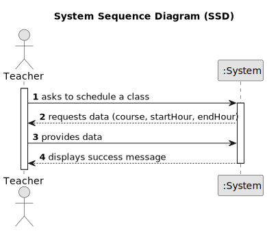

# US 1010 - To Schedule a Class

## 1. Requirements Engineering

### 1.1. User Story Description

As a Teacher, I want to schedule a class.

### 1.2. Customer Specifications and Clarifications 

**From the specifications document:**

>	N/A

**From the client clarifications:**

> **Question:** Nestas duas US, pretende que seja mostrada a lista de Class/ExtraClass que já estão agendadas para que o professor saiba onde pode agendar?
> 
> **Answer:** Em termos de requisitos é importante que o sistema garanta as regras que estão descritas em 5.1.2 relativo a aulas e aulas extra. Em termos de user interface para cada um desses casos de uso não existem requisitos específicos.
Nesse aspeto de "user experience" devem seguir boas práticas. Mas isso já faz parte do desenho da solução. "O cliente não percebe muito disso :-)"

### 1.3. Acceptance Criteria

* N/A

### 1.4. Found out Dependencies

* "US1001: As Manager, I want to be able to register, disable/enable, and list users of the system (Teachers and Students, as well as Managers)." since a teacher is needed to schedule a class.
* "US1002: As Manager, I want to create courses" because each class is part of a course.

### 1.5 Input and Output Data

**Input Data:**

* Typed data:
	* course of the class
    * class start time
    * class end time
    * instructor ID
	
* Selected data:
	* N/A

**Output Data:**

* (In)Success of the operation.

### 1.6. System Sequence Diagram (SSD)

### 1.7 Other Relevant Remarks

* N/A